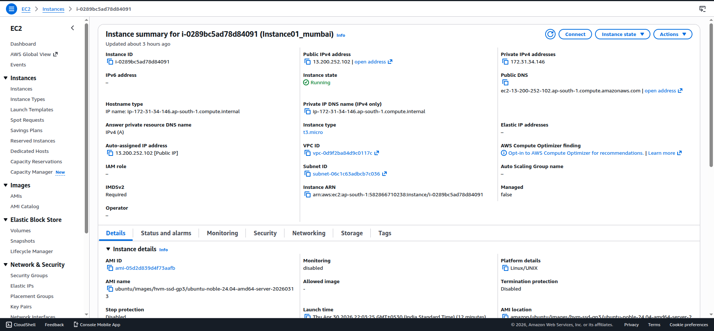
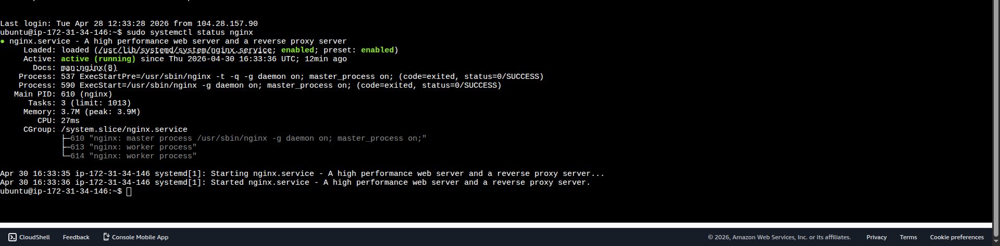
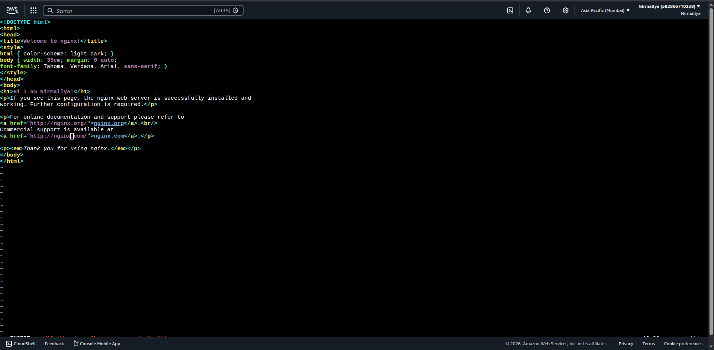
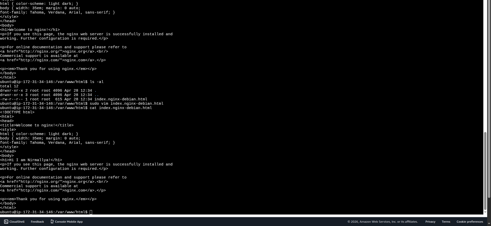
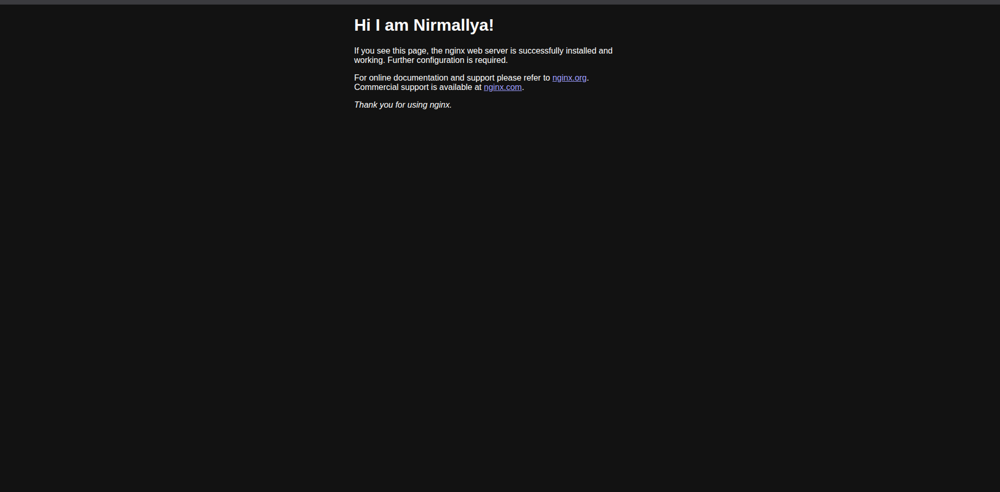
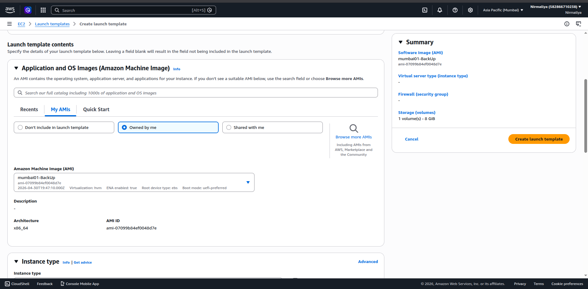
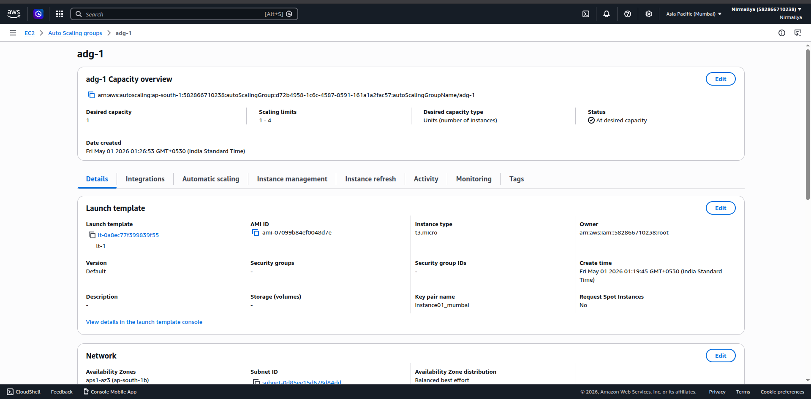
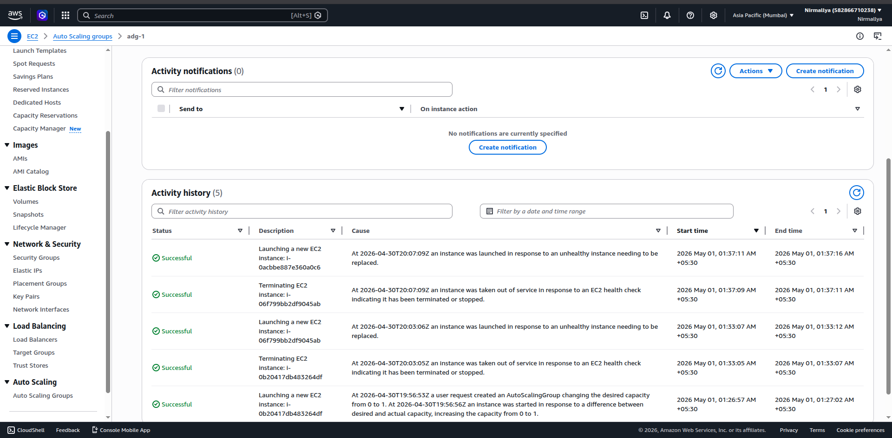
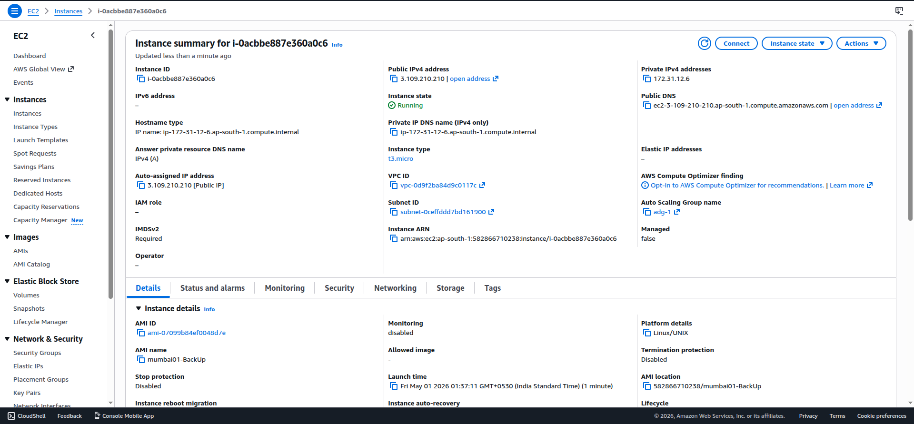

The purpose of this task was to provision a virtual server using Amazon
Web Services and configure it as a web server by installing Nginx. After
validating the server with a custom web page, an image of the instance
was created and used to define a reusable launch configuration. Finally,
an Auto Scaling setup was implemented to automatically manage multiple
instances based on demand.

## **Steps Performed**

- Logged in to the AWS Management Console and navigated to the EC2
  dashboard.

- Initiated instance creation using the **Launch Instance** option.

- Selected the **Amazon Linux AMI** and configured the instance type as
  **t3.micro**.

- Generated a new key pair and downloaded the .pem file for secure
  access.

- Configured network settings to allow inbound HTTP (port 80) traffic
  for browser access.

- Launched the instance and waited until it reached the **Running**
  state.

- Connected to the instance using **EC2 Instance Connect**.

- Installed the Nginx web server using:

sudo apt install nginx -y

- Started the Nginx service:

sudo systemctl start nginx

- Verified that the service was running correctly.

- Modified the default HTML page to include custom content.

- Accessed the application via the instance’s public IP address in a
  browser to confirm successful deployment.

- Created an **AMI (Amazon Machine Image)** from the configured EC2
  instance.

- Used the AMI to define a **Launch Template**.

- Created an **Auto Scaling Group** based on the launch template.

- Configured scaling parameters including minimum, desired, and maximum
  instance counts.

- Validated that multiple instances were automatically provisioned and
  managed by the Auto Scaling Group.

