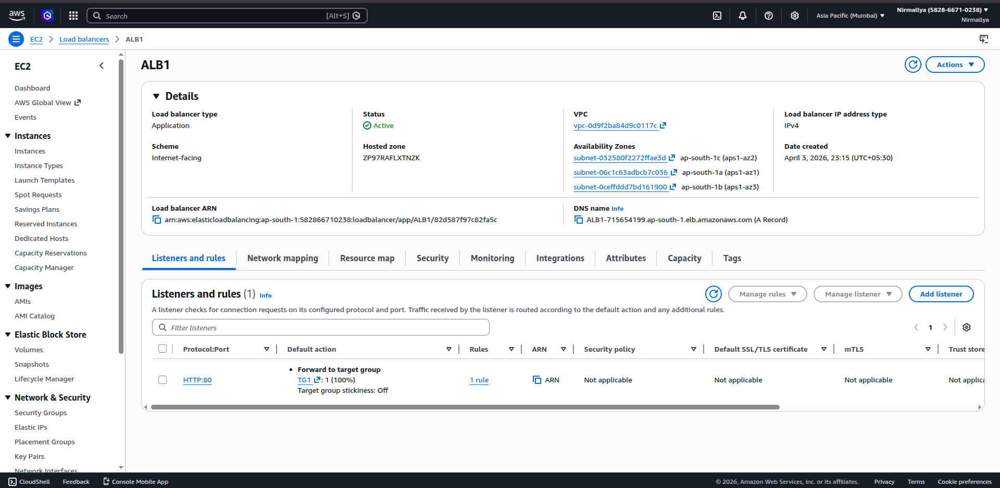
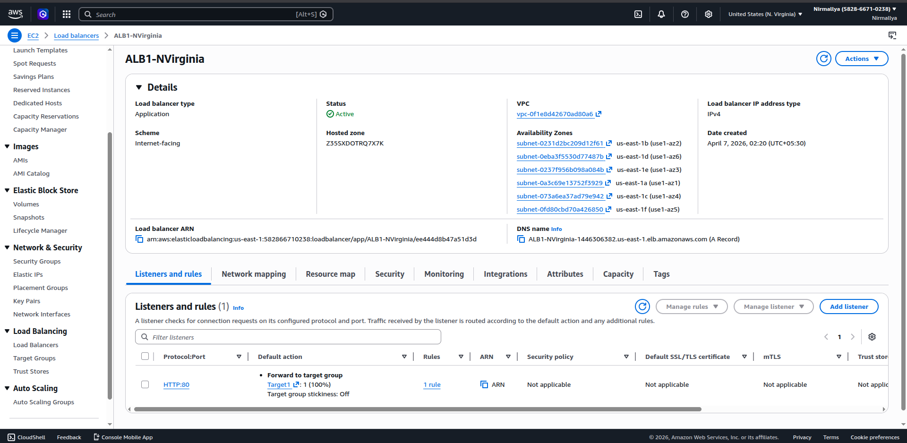
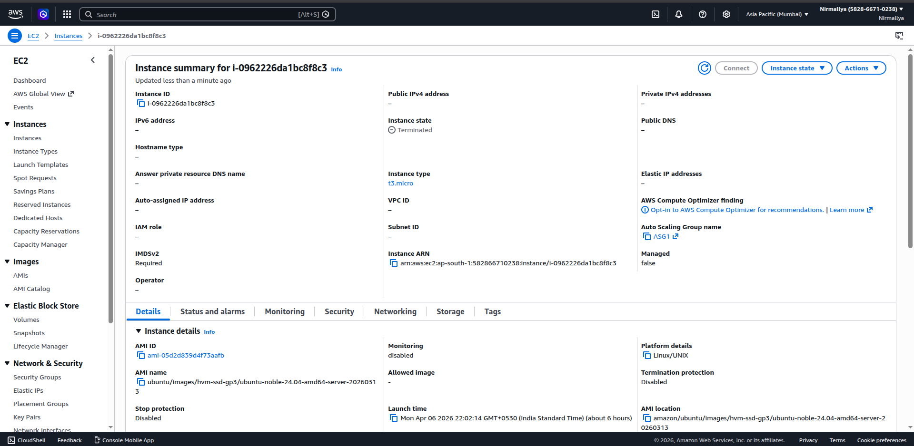
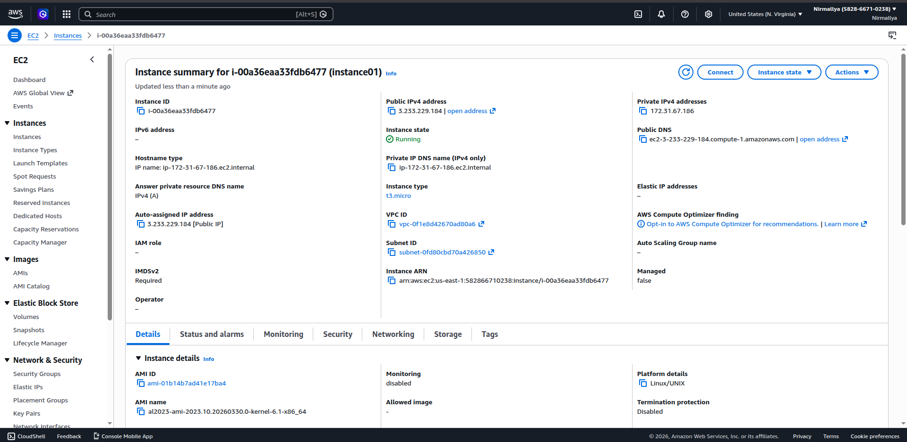
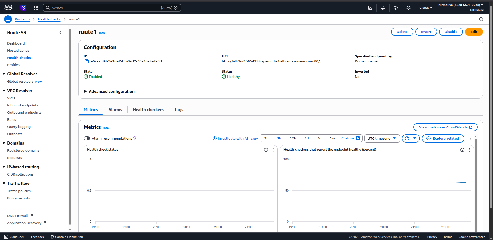
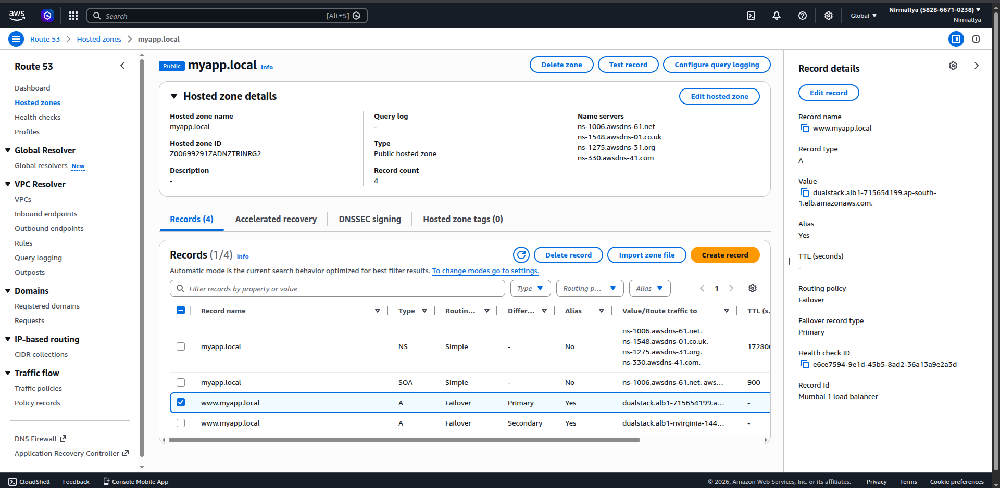
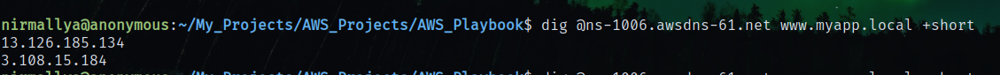
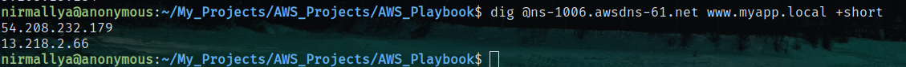

# **AWS Route 53 Failover Routing with Multi-Region ALB**

## **Overview**

This project demonstrates DNS-based failover routing using Amazon Route 53. The architecture includes two Application Load Balancers (ALBs) deployed in different AWS regions. Route 53 monitors the health of the primary region and automatically redirects traffic to a secondary region in case of failure.

## **Architecture**

-   Primary Region: ap-south-1 (Mumbai)

-   Secondary Region: us-east-1 (N. Virginia)

-   Load Balancers: Application Load Balancer (ALB) in each region

-   DNS Service: Amazon Route 53

-   Health Monitoring: Route 53 Health Checks

## **Components**

### **1. Application Load Balancers**

-   Internet-facing ALBs created in both regions

-   Each ALB forwards traffic to EC2 instances via target groups

{width="6.229166666666667in" height="3.0447047244094487in"}\
\
{width="6.25in" height="3.0520833333333335in"}

### **2. EC2 Instances**

-   Deployed in public subnets

-   Serve HTTP responses for testing\
    {width="6.25in" height="3.0520833333333335in"}{width="6.25in" height="3.0520833333333335in"}

### **3. Route 53 Hosted Zone**

-   Public hosted zone created with a test domain:

{width="6.5in" height="3.1770833333333335in"}{width="6.5in" height="3.1770833333333335in"}

### **4. DNS Records**

Two A records configured with Failover routing:

#### **Primary Record**

-   Name: [www.myapp.local](http://www.myapp.local/)

-   Type: A (Alias)

-   Target: Mumbai ALB

-   Routing policy: Failover (Primary)

-   Health check: Attached

#### **Secondary Record**

-   Name: [www.myapp.local](http://www.myapp.local/)

-   Type: A (Alias)

-   Target: Virginia ALB

-   Routing policy: Failover (Secondary)

-   Health check: Not attached

## **Health Check Configuration**

-   Protocol: HTTP

-   Endpoint: Primary ALB DNS

-   Interval: 30 seconds

-   Failure threshold: 3

-   Success criteria: HTTP 2xx or 3xx response

Requesting Primary region DNS (Simulating no failure)

{width="6.5in" height="0.4895833333333333in"}IP of MUMBAI ALB\
\
Requesting Primary region DNS again (Simulating failure (All instances down))\
{width="6.5in" height="0.4895833333333333in"}IP of N.VIRGINIA ALB
