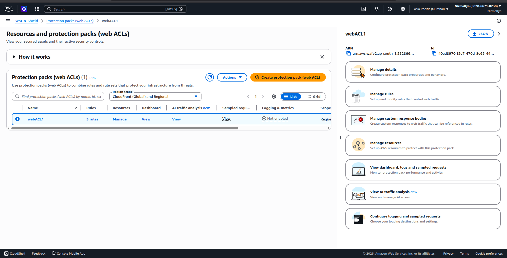
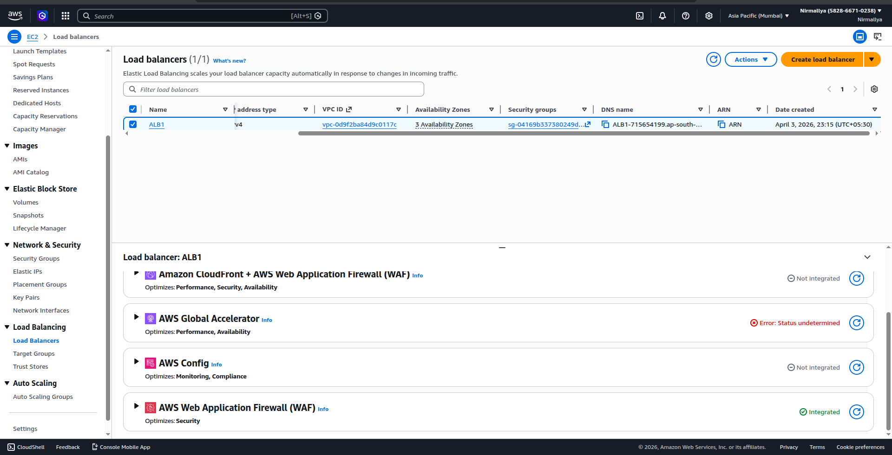
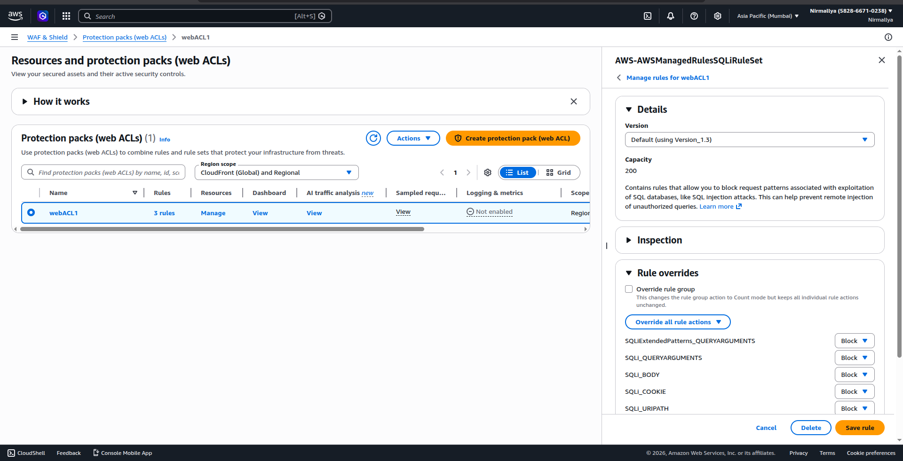
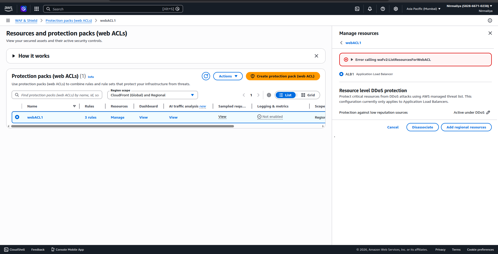
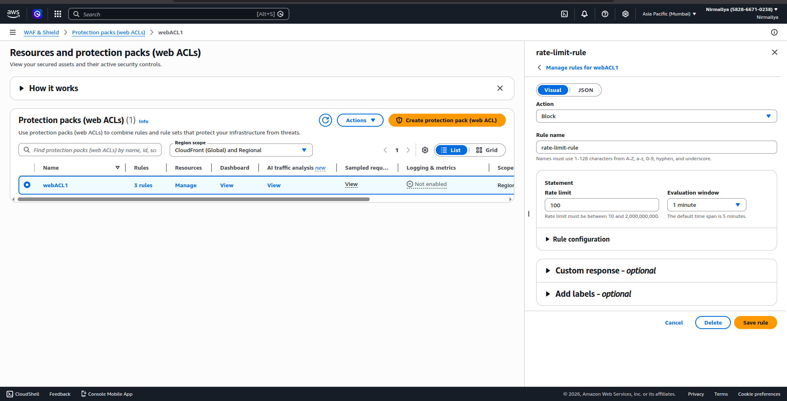
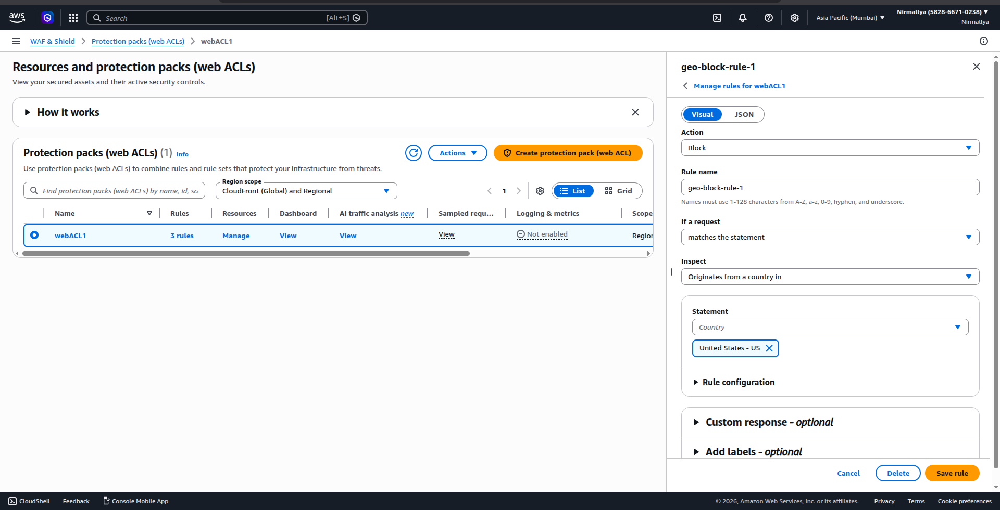
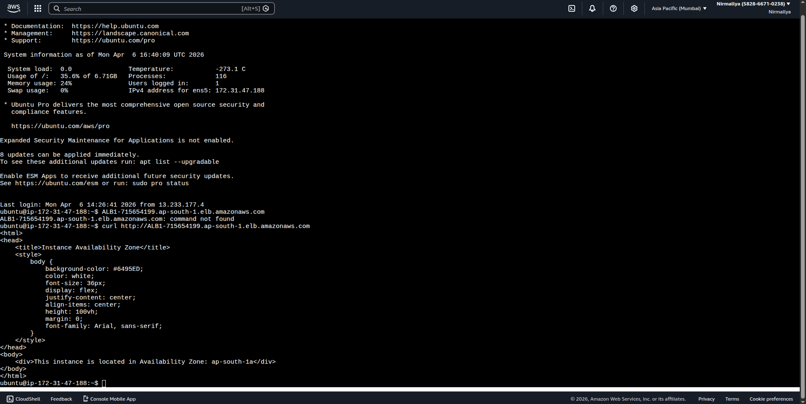
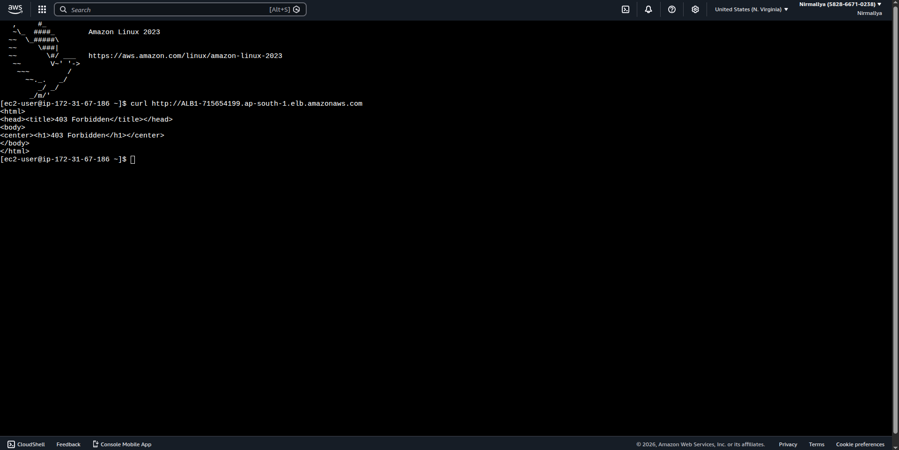

# **AWS WAF Implementation with Application Load Balancer**

## **Objective**

To implement AWS Web Application Firewall (WAF) with an Application Load Balancer (ALB) and configure security rules including SQL injection protection, rate limiting, and geo blocking. The setup is tested using curl commands from EC2 instances.

## **Architecture Overview**

-   Application Load Balancer (ALB)

-   AWS WAF (Web ACL)

-   EC2 instances (for testing)

-   Internet-facing traffic routed through ALB

## **Steps Performed**

### **1. Create Web ACL (WAF)**

-   Navigated to AWS WAF & Shield

-   Created a Web ACL named webACL1

-   Selected resource type supporting Application Load Balancer\
    \
    {width="6.25in" height="3.1979166666666665in"}{width="6.25in" height="3.1979166666666665in"}

### **2. Add SQL Injection Protection**

-   Added AWS Managed Rule Group:

    -   AWSManagedRulesSQLiRuleSet

-   Configured rule action as Block

-   Applied to all requests

{width="6.5in" height="3.3229166666666665in"}

### **3. Attach WAF to ALB**

-   Associated Web ACL with ALB (ALB1)

-   Verified integration through WAF console and ALB settings

{width="6.5in" height="3.3229166666666665in"}

### **4. Add Rate Limiting Rule**

-   Created a rate-based rule:

    -   Name: rate-limit-rule

    -   Limit: 100 requests per 5 minutes per IP

    -   Action: Block

{width="6.5in" height="3.3229166666666665in"}

### **5. Add Geo Blocking Rule**

-   Created custom rule:

    -   Name: geo-block-rule

    -   Rule type: Geo match

    -   Blocked country: United States (for testing)

    -   Action: Block

{width="6.5in" height="3.3229166666666665in"}

### **6. Rule Priority Order**

Rules were configured in the following order:

1.  SQL Injection Rule

2.  Rate Limiting Rule

3.  Geo Blocking Rule

## **Testing**

### **1. Normal Request**

curl <http://> ALB1-715654199.ap-south-1.elb.amazonaws.com

From India ( succesfull )

{width="4.447916666666667in" height="2.2310859580052496in"}

From USA

{width="6.5in" height="3.2604166666666665in"}

Unsuccesful 403 Forbidden.
