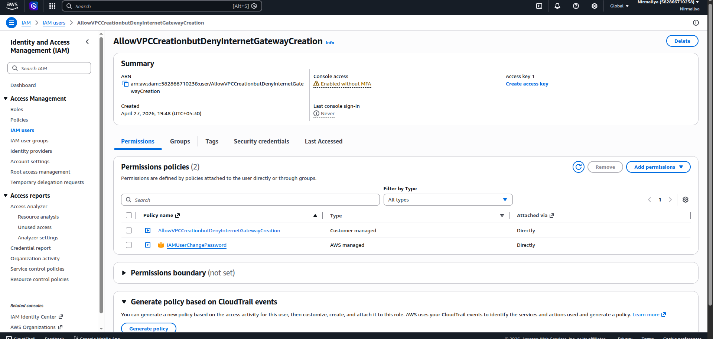
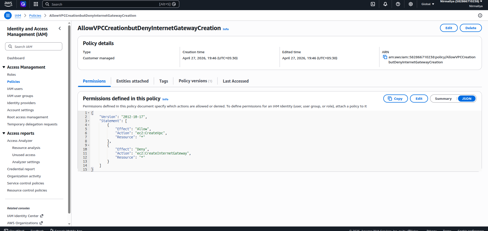

# **Allow VPC Creation but Deny Internet Gateway Creation**

## **Objective**

Create an IAM policy that:

- Allows creation of Virtual Private Clouds (VPCs)

- Denies creation of Internet Gateways

## **Key Concepts**

- IAM policies define permissions using **Allow** and **Deny**

- **Explicit Deny overrides Allow**

- AWS services expose fine-grained actions (e.g., ec2:CreateVpc,
  ec2:CreateInternetGateway)

- Restricting specific actions enables tighter network security control

