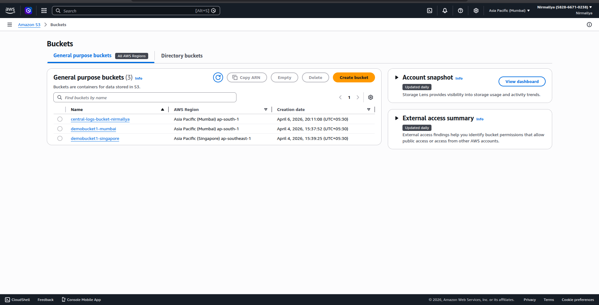
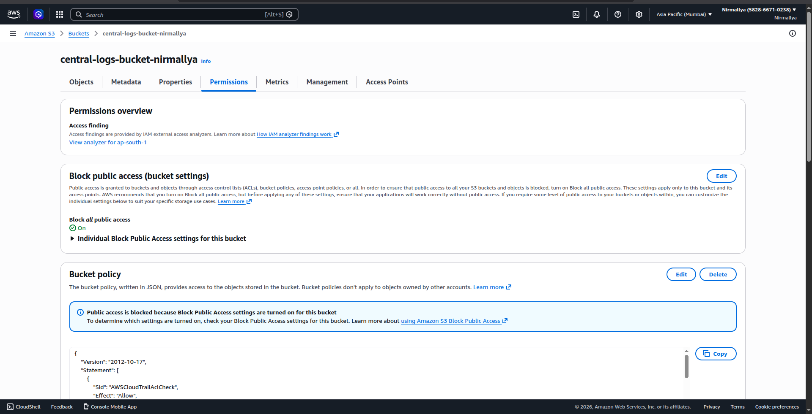
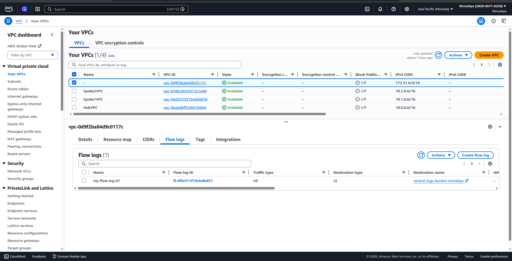
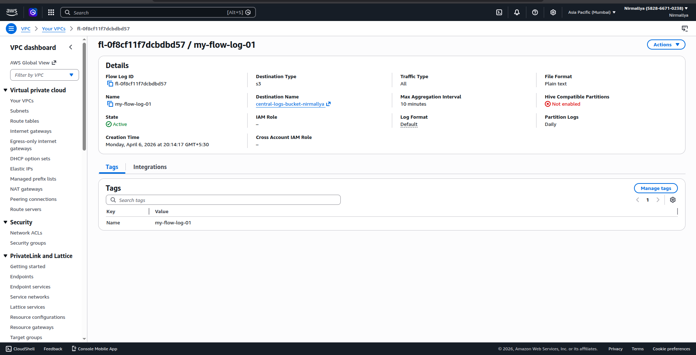
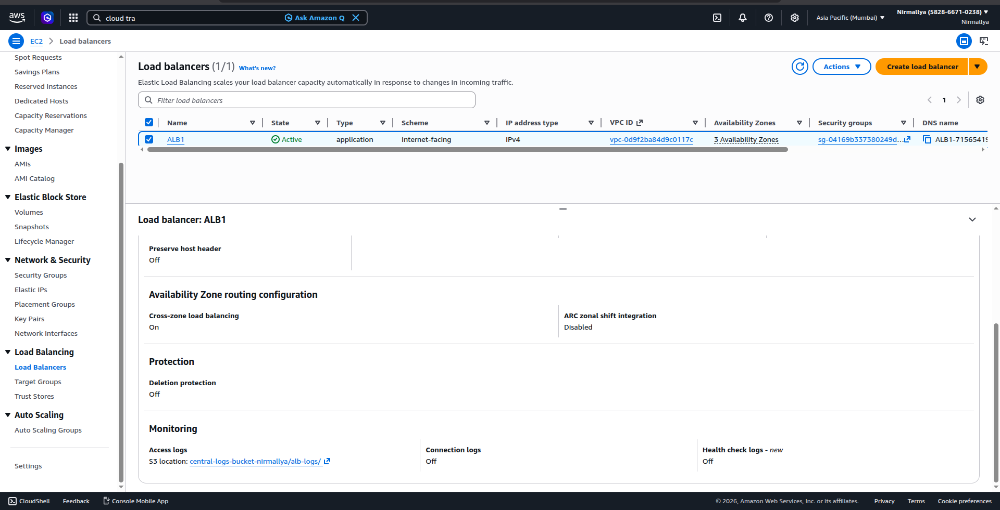
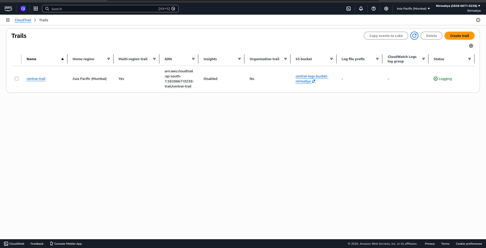
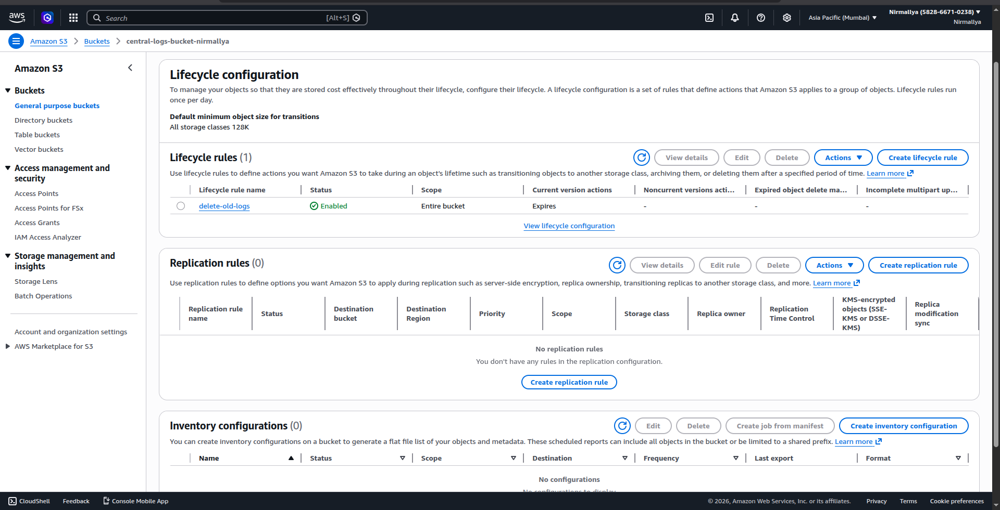
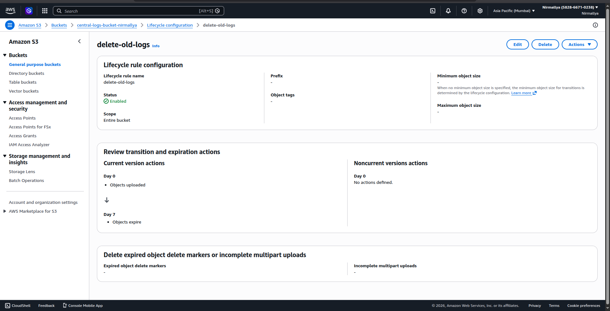

# **Centralized Logging Architecture on AWS**

## **Overview**

This project demonstrates a centralized logging architecture using AWS services. Logs from multiple sources such as VPC Flow Logs, Application Load Balancer (ALB), and CloudTrail are collected and stored in a single Amazon S3 bucket. A lifecycle policy is applied to automatically delete old logs.

## **Architecture Components**

-   Amazon S3 (Central log storage)

-   VPC Flow Logs (Network traffic logging)

-   Application Load Balancer Access Logs (Request logging)

-   AWS CloudTrail (API activity logging)

-   S3 Lifecycle Policy (Automatic cleanup)

## **Implementation Steps**

### **1. Create Central S3 Bucket**

-   Navigate to S3 and create a bucket:

    -   Name: central-logs-bucket-nirmallya

    -   Region: Same as other resources

-   Keep default settings (block public access enabled)\
    \
    {width="6.25in" height="3.1979166666666665in"}{width="6.25in" height="3.1979166666666665in"}

### **2. Enable VPC Flow Logs**

-   Go to VPC → Select your VPC

-   Click on \"Flow Logs\" → Create flow log

-   Configure:

    -   Filter: ALL

    -   Destination: Send to S3

    -   Select the central S3 bucket

{width="6.5in" height="3.3229166666666665in"}{width="6.5in" height="3.3229166666666665in"}

### **3. Enable ALB Access Logs**

-   Go to EC2 → Load Balancers

-   Select your Application Load Balancer

-   Edit attributes:

    -   Enable Access Logs

    -   S3 Bucket: central-logs-bucket-nirmallya

    -   Prefix: alb-logs

-   Update S3 bucket policy to allow ALB log delivery

{width="6.5in" height="3.3229166666666665in"}

### **4. Enable CloudTrail**

-   Go to CloudTrail → Create trail

-   Configure:

    -   Trail name: central-trail

    -   Storage: Use existing S3 bucket

    -   Bucket: central-logs-bucket-nirmallya

    -   Prefix: Leave empty

    -   Multi-region: Enabled

    -   SSE-KMS: Disabled

-   CloudTrail logs are stored under:

    -   /AWSLogs/\<account-id\>/CloudTrail/

{width="6.5in" height="3.3229166666666665in"}

### **5. Configure S3 Lifecycle Rule**

-   Go to S3 → Bucket → Management → Lifecycle rules

-   Create a rule:

    -   Name: delete-old-logs

    -   Scope: Entire bucket

    -   Action: Expire current versions of objects

    -   Expiration: 7 days

{width="6.5in" height="3.3229166666666665in"}{width="6.5in" height="3.3229166666666665in"}

## **Log Storage Structure**

central-logs-bucket-nirmallya/

├── alb-logs/

├── AWSLogs/

│ ├── /

│ │ ├── CloudTrail/

│ │ └── VPCFlowLogs/

## **Verification Steps**

1.  Generate traffic:

    a.  Access the ALB DNS

    b.  Perform AWS console actions

2.  Verify logs in S3:

    a.  ALB logs → alb-logs/

    b.  CloudTrail logs → /AWSLogs/\<account-id\>/CloudTrail/

    c.  VPC Flow Logs → /AWSLogs/\<account-id\>/

3.  Confirm .log.gz and .json.gz files are present

## **Key Benefits**

-   Centralized log storage for easier monitoring

-   Simplified debugging and auditing

-   Automated log cleanup using lifecycle rules

-   Cost optimization through log expiration

## **Conclusion**

A centralized logging system was successfully implemented using AWS services. Logs from multiple sources are aggregated into a single S3 bucket and managed efficiently using lifecycle policies.
