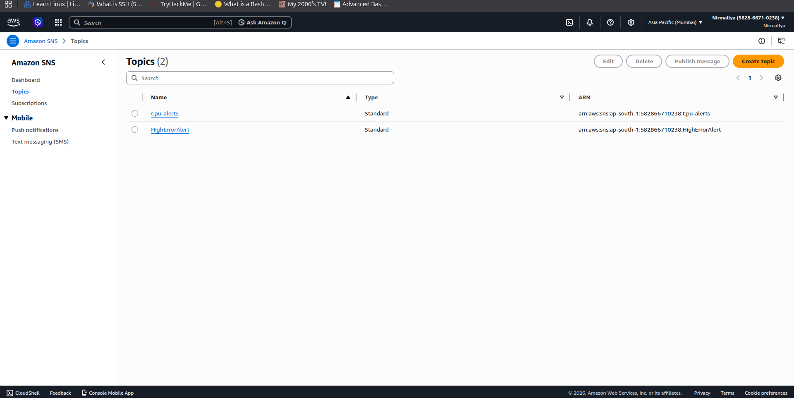
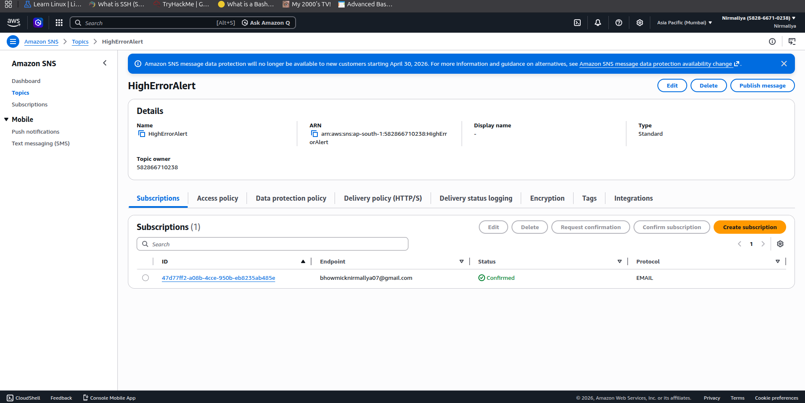
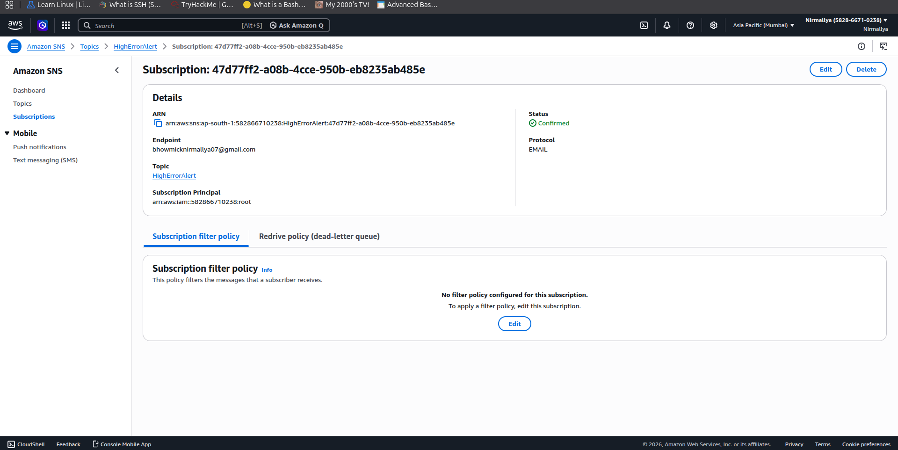
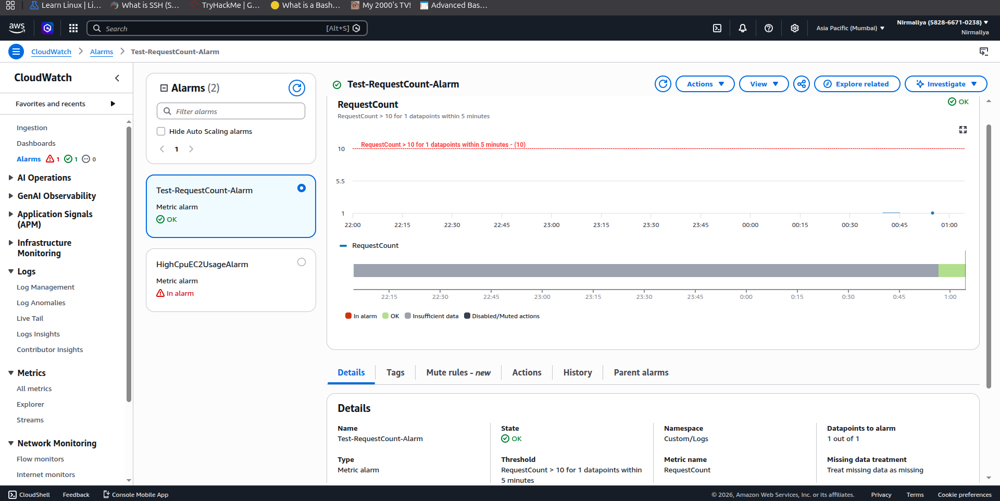
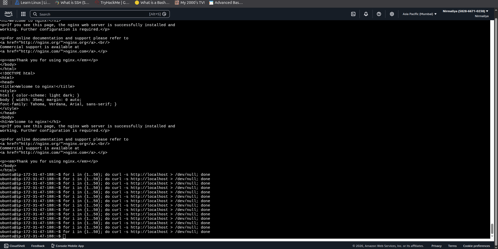
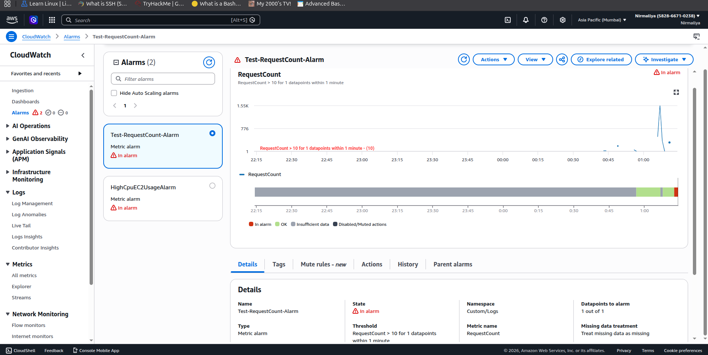
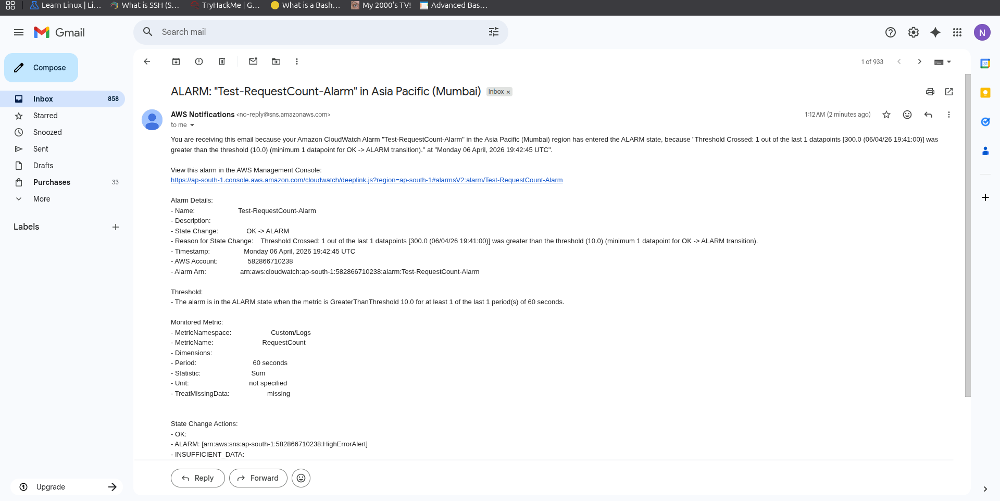

# **CloudWatch SNS Alert Setup**

## **Objective**

Configure Amazon SNS with a CloudWatch alarm to send email notifications when a metric threshold is breached. This setup validates the alerting pipeline before integrating advanced error-rate monitoring.

## **Architecture Overview**

EC2 Instance → CloudWatch Metrics → CloudWatch Alarm → SNS Topic → Email Notification

## **Prerequisites**

-   AWS account with access to CloudWatch and SNS

-   EC2 instance generating traffic (for RequestCount metric)

-   CloudWatch metric RequestCount available under Custom/Logs

## **Step 1: Create SNS Topic**

1.  Navigate to **AWS Console → SNS → Topics**

2.  Click **Create topic**

3.  Configure:

    a.  Type: Standard

    b.  Name: HighErrorAlert

4.  Click **Create topic**

{width="6.5in" height="3.2604166666666665in"}{width="6.5in" height="3.2604166666666665in"}

## **Step 2: Create SNS Subscription**

1.  Open the created topic HighErrorAlert

2.  Click **Create subscription**

3.  Configure:

    a.  Protocol: Email

    b.  Endpoint: your email address

4.  Click **Create subscription**

{width="6.5in" height="3.2604166666666665in"}

### **Important**

-   Check your email inbox

-   Confirm the subscription

-   Notifications will not be delivered unless confirmed

## **Step 3: Create CloudWatch Alarm**

1.  Navigate to **CloudWatch → Metrics**

2.  Go to **Custom/Logs**

3.  Select the metric RequestCount

4.  Click **Create alarm**

## **Step 4: Configure Alarm**

### **Metric Configuration**

-   Metric: RequestCount

-   Namespace: Custom/Logs

### **Conditions**

-   Threshold type: Static

-   Condition: Greater than 10

-   Period: 1 minute

-   Evaluation periods: 1

{width="6.5in" height="3.2604166666666665in"}

## **Step 5: Configure Actions**

1.  Select **Send a notification to an SNS topic**

2.  Choose existing topic: HighErrorAlert

## **Step 6: Name and Create Alarm**

-   Alarm name: Test-RequestCount-Alarm

-   Click **Create alarm**

## **Step 7: Test the Alarm**

Generate traffic on the EC2 instance:

\`\`\`bash for i in {1..50}; do curl [http://localhost](http://localhost/); done\
\
{width="6.5in" height="3.2604166666666665in"}{width="6.5in" height="3.2604166666666665in"}{width="6.5in" height="3.2604166666666665in"}
