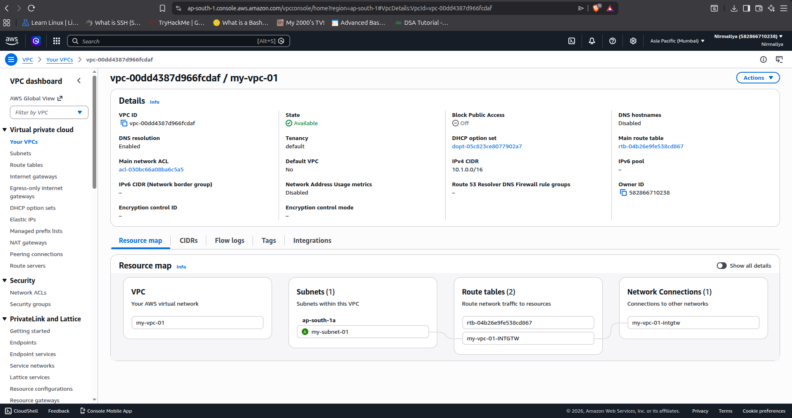
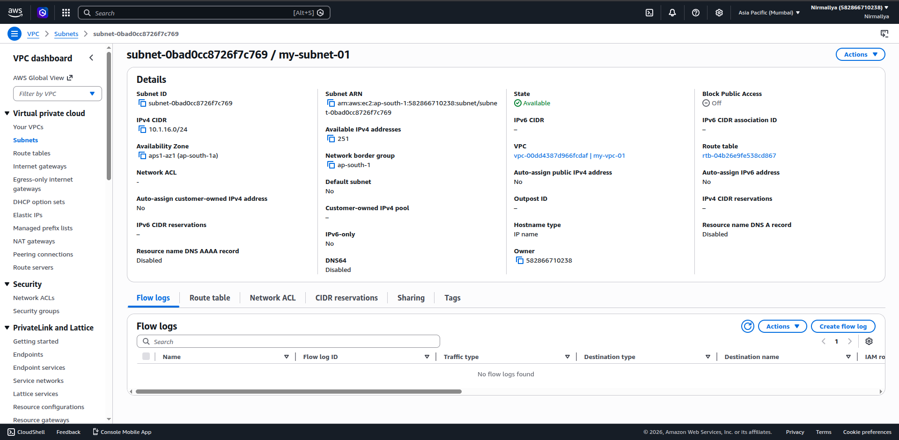
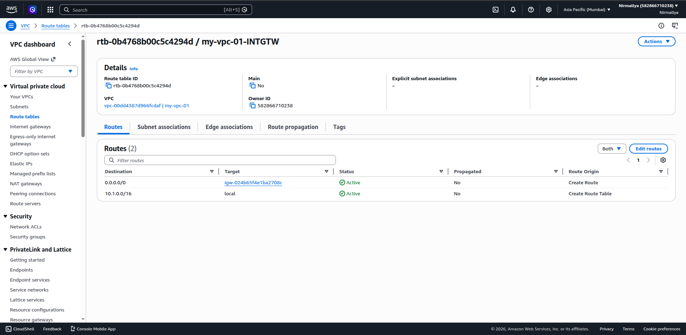
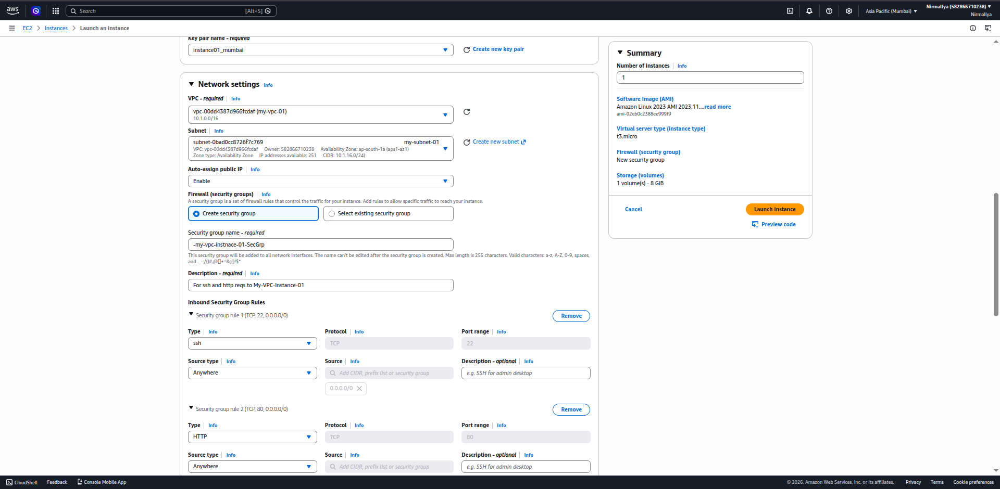
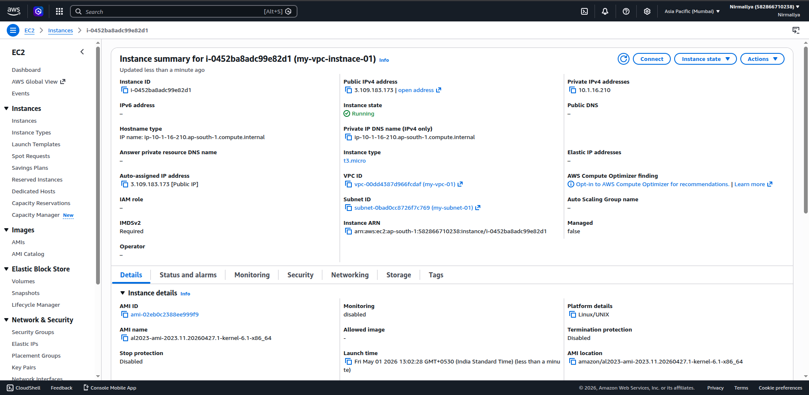
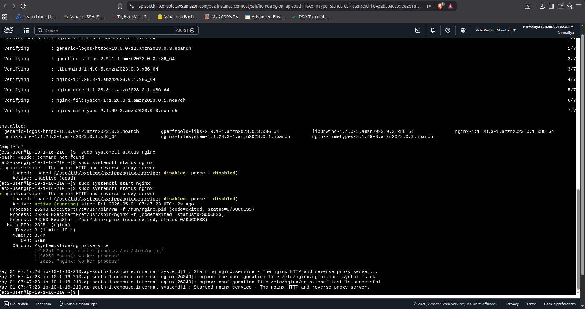
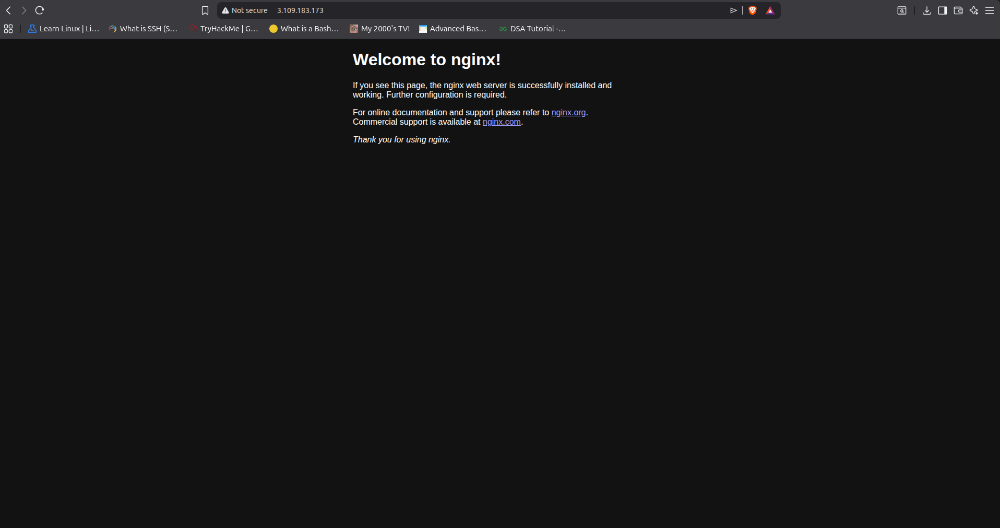

#### **Custom VPC Setup with EC2 and Nginx Deployment**

## **Objective**

The objective of this task was to design and configure a custom Virtual
Private Cloud (VPC) with essential networking components, and deploy an
EC2 instance within it. The instance was configured with Nginx to
validate external accessibility over the internet using Amazon Web
Services.

## **Steps Performed**

1.  **Create a Custom VPC**  
    Logged in to the AWS Management Console and navigated to the VPC
    dashboard. Created a new VPC with the following configuration:

    1.  Name: my-vpc

    2.  IPv4 CIDR block: 10.1.0.0/16

2.  **Create Subnets**  
    Defined a public subnet within the VPC:

    1.  CIDR block: 10.0.16.0/20

    2.  Configured within the same region and availability zone

3.  **Create and Attach Internet Gateway**  
    Created an Internet Gateway and attached it to the VPC to enable
    outbound and inbound internet connectivity.

4.  **Configure Route Table**  
    Created a route table and added the following route:

    1.  Destination: 0.0.0.0/0

    2.  Target: Internet Gateway  
        Associated this route table with the public subnet to allow
        internet access.

5.  **Create Security Group**  
    Configured a security group with inbound rules to allow:

    1.  SSH (port 22)

    2.  HTTP (port 80)

6.  **Launch EC2 Instance in VPC**  
    Launched an EC2 instance with the following configurations:

    1.  Selected the custom VPC and public subnet

    2.  Attached the configured security group

    3.  Enabled auto-assign public IP for external access

7.  **Install and Configure Nginx**  
    Connected to the instance and executed:

sudo yum update -y  
sudo yum install nginx -y  
sudo systemctl start nginx  
sudo systemctl enable nginx

8.  **Test the Web Server**  
    Retrieved the public IP address of the instance and accessed it via
    a web browser. The default Nginx welcome page confirmed successful
    deployment.

## **Result**

A fully functional custom VPC environment was successfully created,
including networking components such as subnets, route tables, and an
Internet Gateway. An EC2 instance deployed within this VPC was
configured with Nginx and verified to be publicly accessible,
demonstrating correct end-to-end infrastructure setup.

