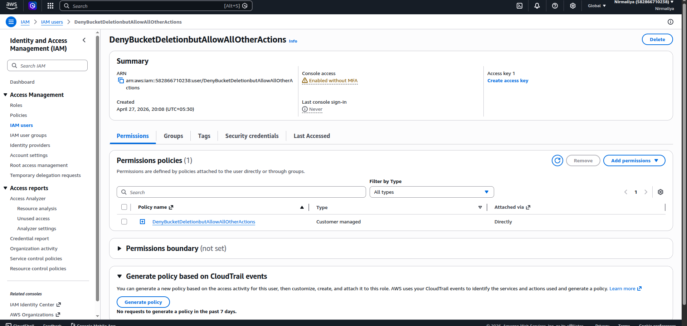
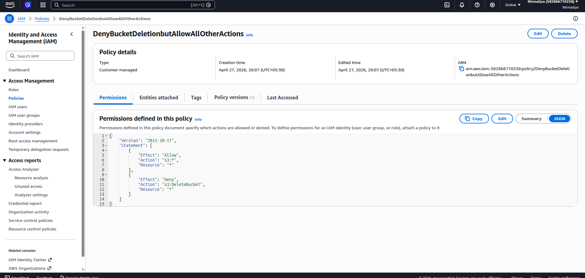

# **Deny Bucket Deletion but Allow All Other Actions**

## **Objective**

Create an IAM policy that:

- Allows all Amazon S3 actions

- Explicitly denies deletion of S3 buckets

## **Key Concepts**

- IAM policies follow **Allow** and **Deny** rules

- **Explicit Deny overrides Allow**

- Fine-grained control is achieved by targeting specific actions

- Preventing bucket deletion helps protect critical data

