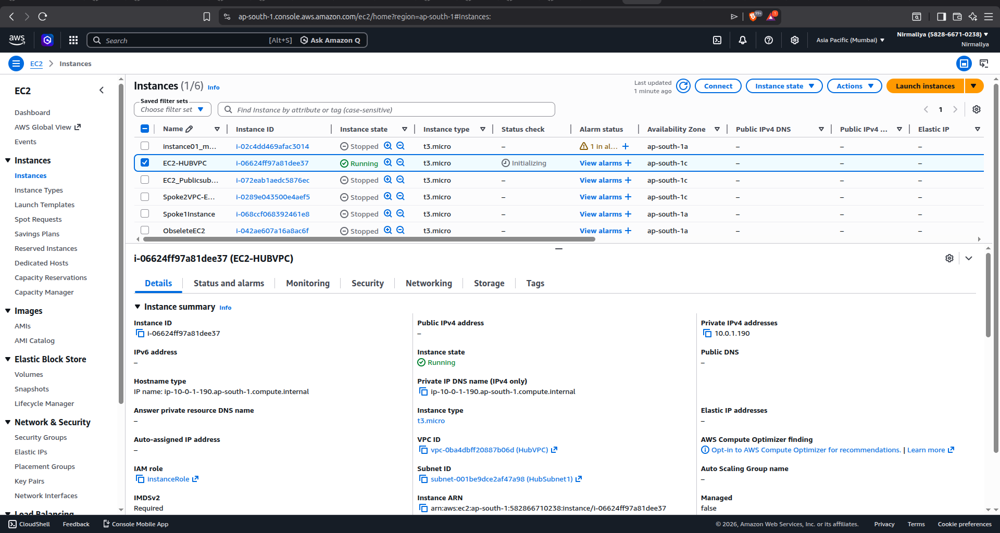
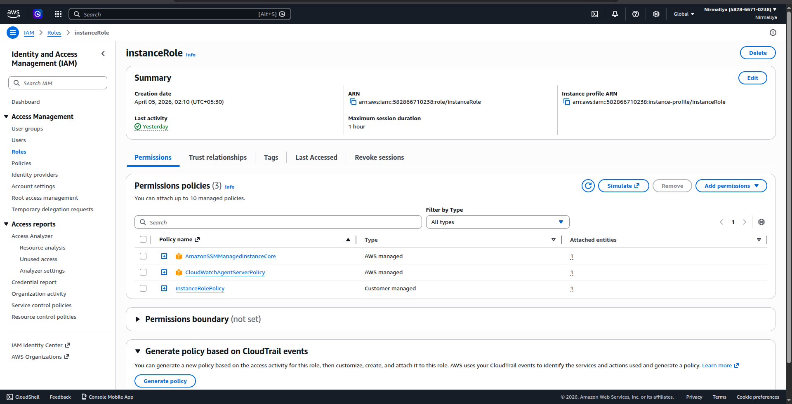
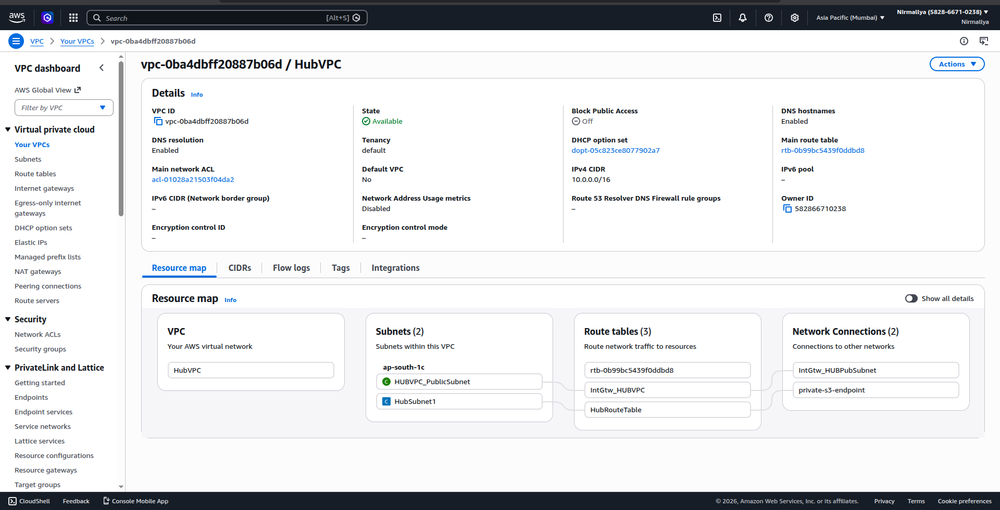
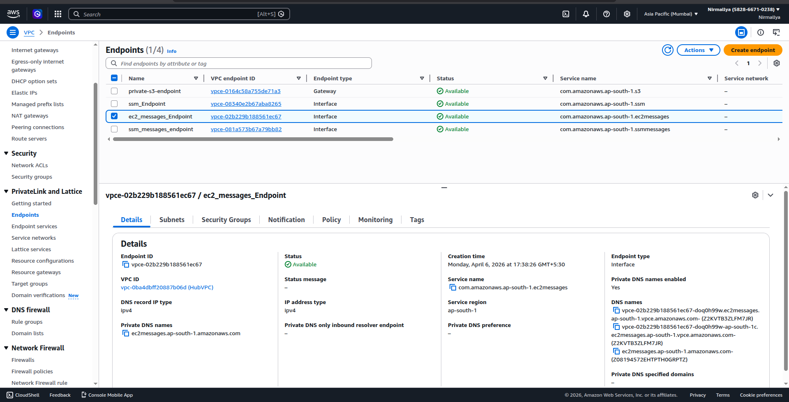
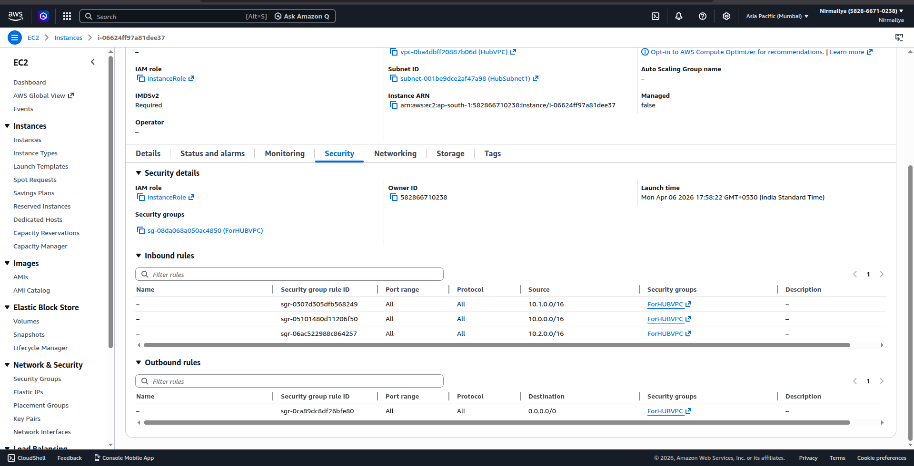
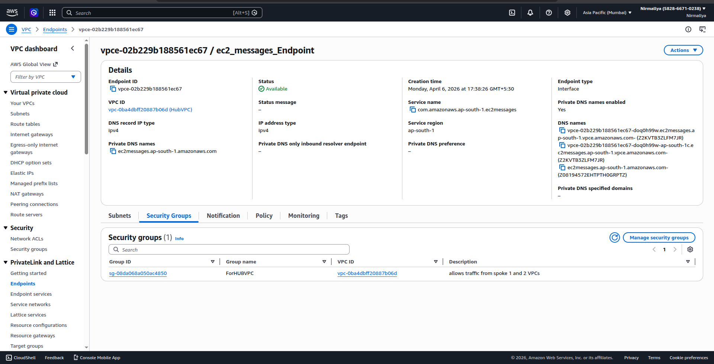
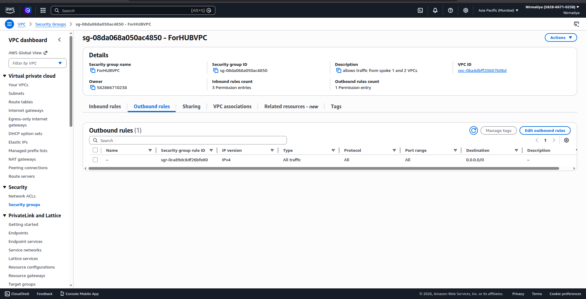
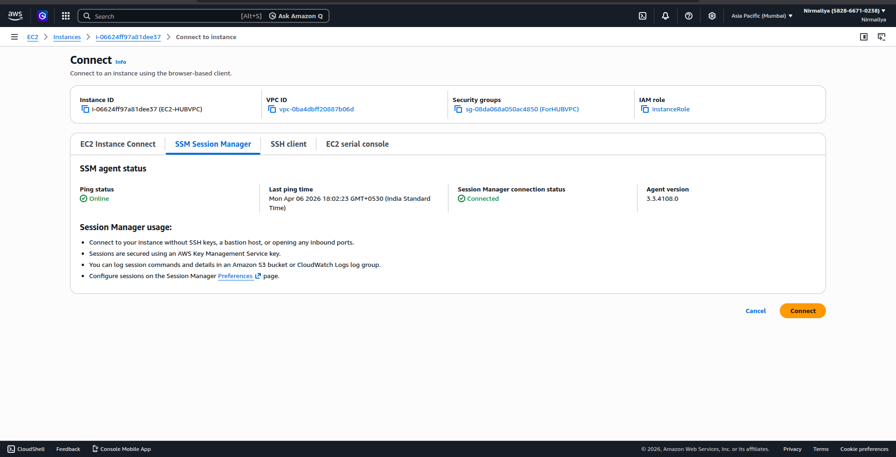
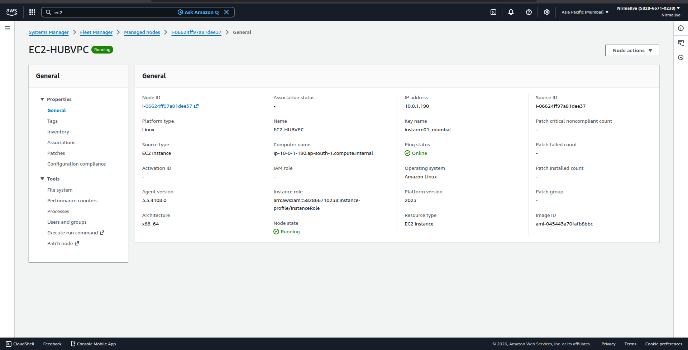
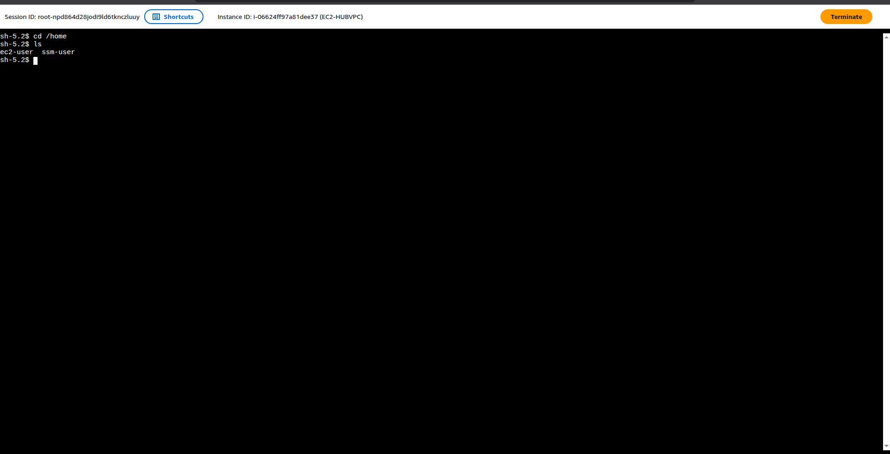

# **Bastion-less Access to Private EC2 using AWS Systems Manager**

## **Overview**

This setup enables secure access to a private EC2 instance without using a bastion host or SSH.

Access is achieved via **AWS Systems Manager Session Manager**, keeping the instance fully private.

## **Architecture**

-   EC2 instance in **private subnet**

-   **No public IP**

-   **No inbound ports (SSH disabled)**

-   Access via **SSM over HTTPS (port 443 outbound)**

## **Components Used**

-   Amazon EC2

-   AWS Systems Manager (SSM)

-   IAM Role (AmazonSSMManagedInstanceCore)

-   VPC Interface Endpoints:

    -   ssm

    -   ec2messages

    -   ssmmessages

## **Step-by-Step Setup**

### **1. Launch EC2 Instance**

-   Place instance in a **private subnet**

-   Do **not assign public IP**

{width="6.5in" height="3.46875in"}

### **2. Attach IAM Role**

Attach role with policy:

AmazonSSMManagedInstanceCore

{width="6.5in" height="3.3229166666666665in"}

### **3. Enable VPC DNS Settings**

Go to VPC → Edit settings:

-   Enable DNS resolution ✅

-   Enable DNS hostnames ✅

{width="6.5in" height="3.3229166666666665in"}

### **4. Create VPC Interface Endpoints**

Create the following endpoints in the same VPC and subnet:

com.amazonaws.\<region\>.ssm\
com.amazonaws.\<region\>.ec2messages\
com.amazonaws.\<region\>.ssmmessages

Configuration:

-   Type: Interface

-   Subnet: Private subnet

-   Security Group: Allow HTTPS (443)

-   Private DNS: Enabled ✅

-   Policy: Full access

{width="6.5in" height="3.3229166666666665in"}

### **5. Security Group Configuration**

#### **EC2 Instance**

-   Inbound: None

-   Outbound: Allow HTTPS (443)

{width="6.5in" height="3.3229166666666665in"}

#### **VPC Endpoint**

-   Inbound: HTTPS (443) from VPC CIDR

-   Outbound: Default (allow all)

{width="6.5in" height="3.3229166666666665in"}{width="6.5in" height="3.3229166666666665in"}

### **6. Connect via Session Manager**

Navigate:

EC2 → Instance → Connect → Session Manager

{width="6.5in" height="3.3229166666666665in"}

OR

Systems Manager → Fleet Manager → Managed Instances

{width="6.5in" height="3.3229166666666665in"}

## **Verification**

-   Instance appears under **Managed Instances**

-   Session Manager opens terminal successfully

-   No SSH or public IP required

{width="6.5in" height="3.3229166666666665in"}

## **Key Benefits**

-   No bastion host required

-   No SSH keys or port 22 exposure

-   Fully private architecture

-   IAM-based access control

-   Audit logging support

## **Optional Enhancements**

-   Enable session logging (CloudWatch / S3)

-   Restrict IAM access to specific users/instances

-   Remove all inbound security group rules

## **Conclusion**

This architecture demonstrates a secure, scalable, and production-ready way to access EC2 instances using AWS-native services without exposing infrastructure to the internet.
