# **Disaster Recovery Setup (AWS)**

## **Overview**

In this project, we implemented a basic Disaster Recovery (DR) setup using AWS services. The aim is to make sure our application can still run even if one AWS region fails.

## **Services Used**

-   Amazon S3

-   Amazon RDS (MySQL)

-   Amazon EC2

-   AMI (Amazon Machine Image)

## **Implementation Steps**

### **1. S3 Cross-Region Replication**

-   Created an S3 bucket in primary region

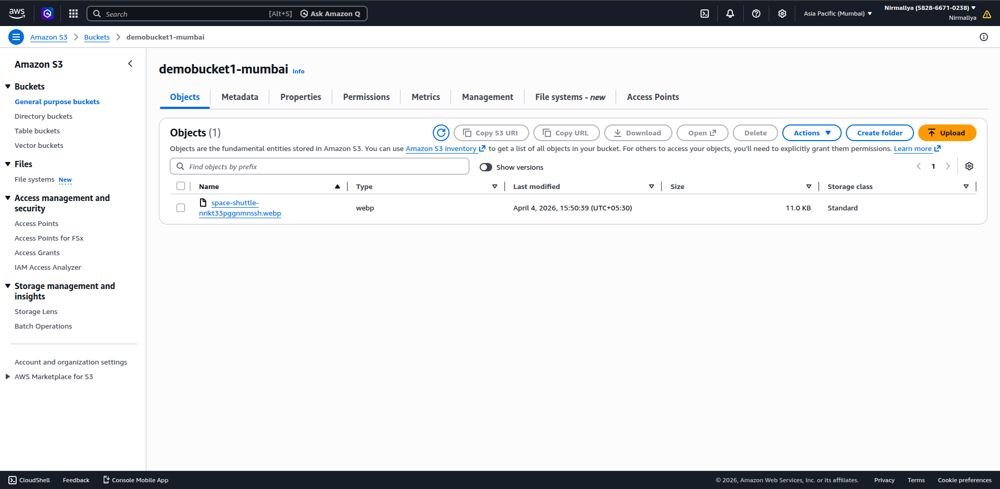{width="3.9895833333333335in" height="1.9500371828521434in"}

-   Created another bucket in a different region

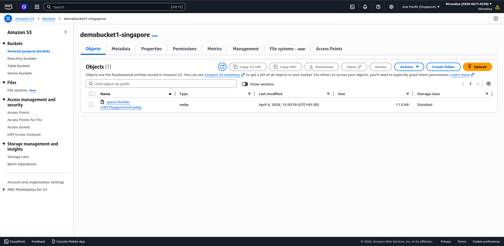{width="4.416666666666667in" height="2.1587871828521434in"}

-   Enabled versioning on both buckets

{width="3.284113079615048in" height="1.6052154418197726in"}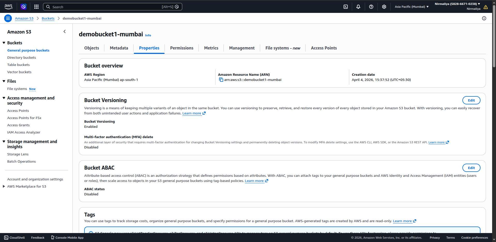{width="3.3035225284339456in" height="1.614702537182852in"}

👉 Now all files uploaded in primary bucket are automatically copied to the secondary region.

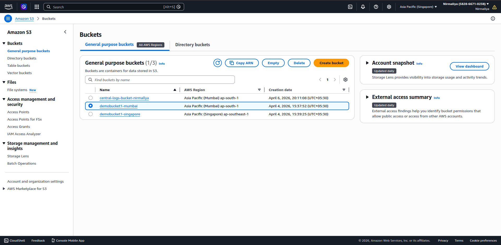{width="6.5in" height="3.1770833333333335in"}

### **2. RDS Read Replica**

-   Created a primary MySQL RDS instance

-   Added a Read Replica

-   Replica automatically syncs data from primary DB

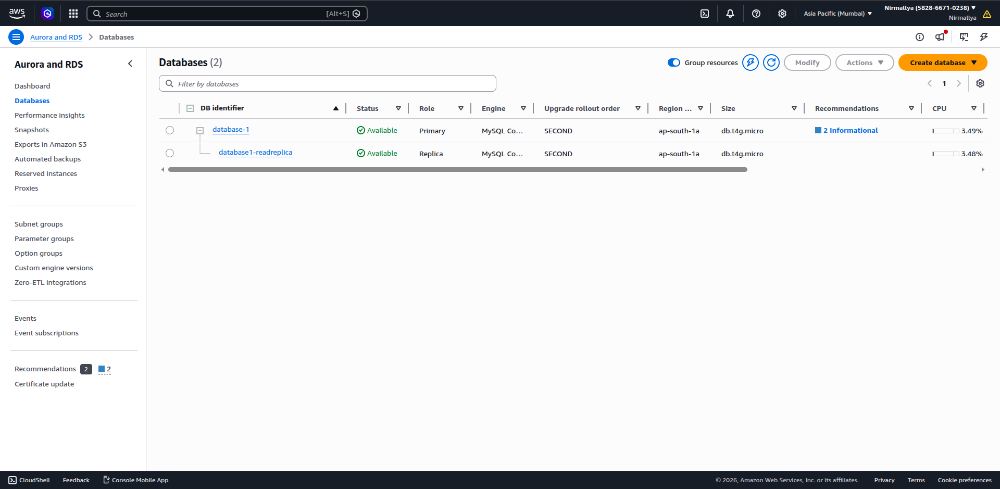{width="6.5in" height="3.1770833333333335in"}

👉 Used to handle read traffic and also acts as backup DB.

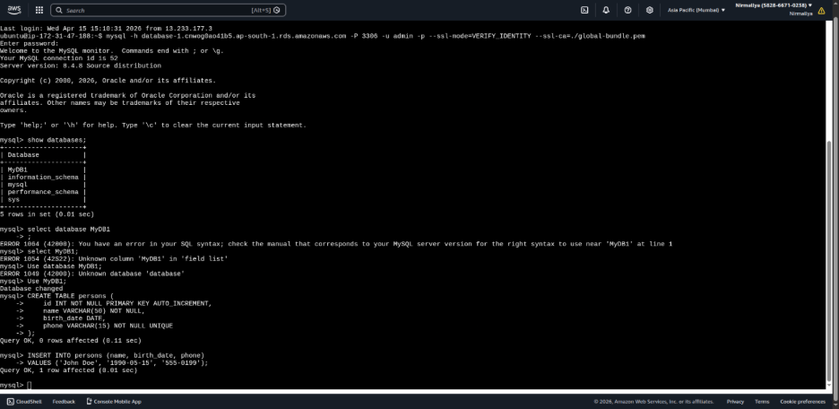{width="6.5in" height="3.1666666666666665in"}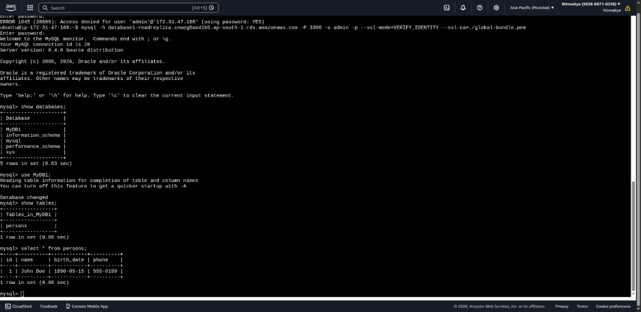{width="6.5in" height="3.1666666666666665in"}

### **3. AMI Backup**

-   Created an AMI of the EC2 instance

-   AMI stores OS + installed apps + configuration

Can launch a new EC2 instance anytime using this AMI.

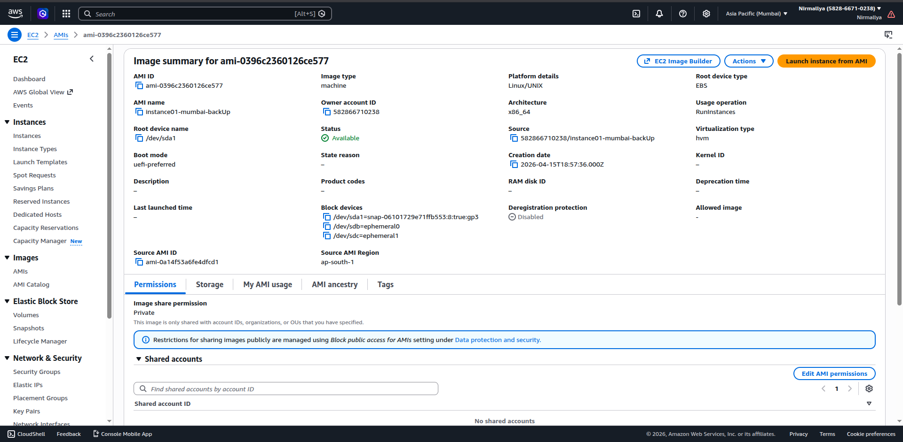{width="5.770833333333333in" height="2.82992782152231in"}

### **4. Simulating Region Failure**

-   Stopped primary EC2 instance

-   Stopped primary RDS database

-   Launched new EC2 instance using AMI

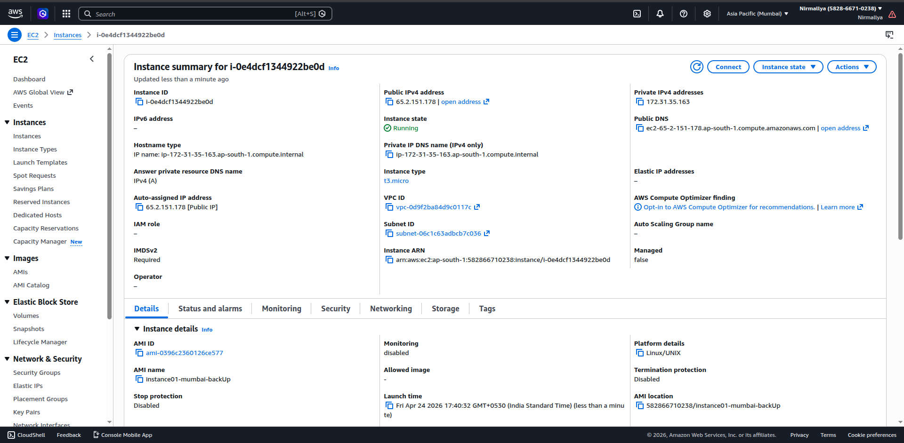{width="5.010416666666667in" height="2.457030839895013in"}

-   Accessed from new EC2 launched through AMI:

    -   Data from S3 replicated bucket

> 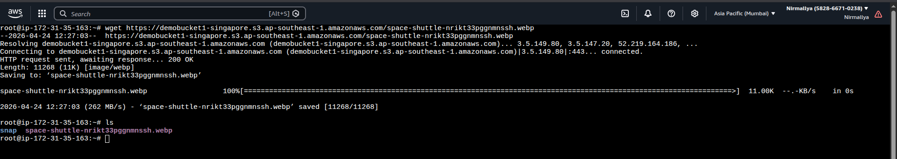{width="4.958333333333333in" height="0.8820111548556431in"}

-   Data from RDS read replica

> 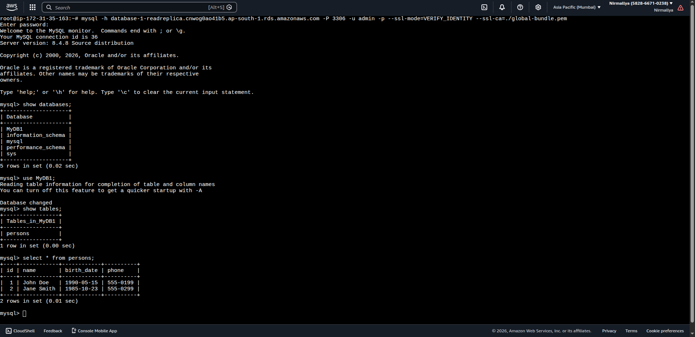{width="6.5in" height="3.15625in"}

## **Conclusion**

This setup provides a simple disaster recovery solution:

-   S3 ensures file backup across regions

-   RDS Read Replica provides database failover option

-   AMI helps quickly restore servers
