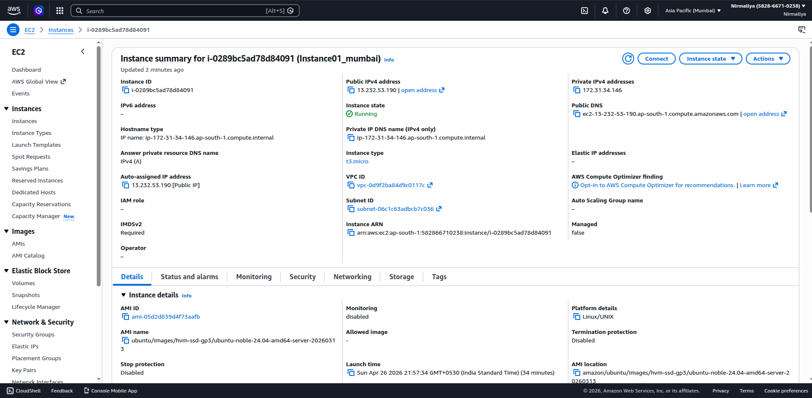
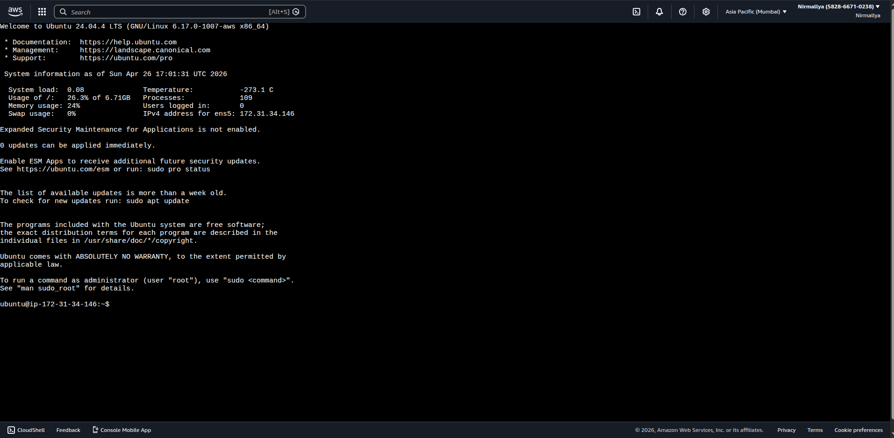
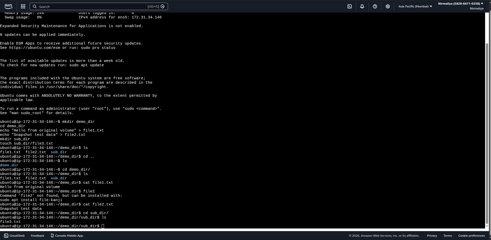
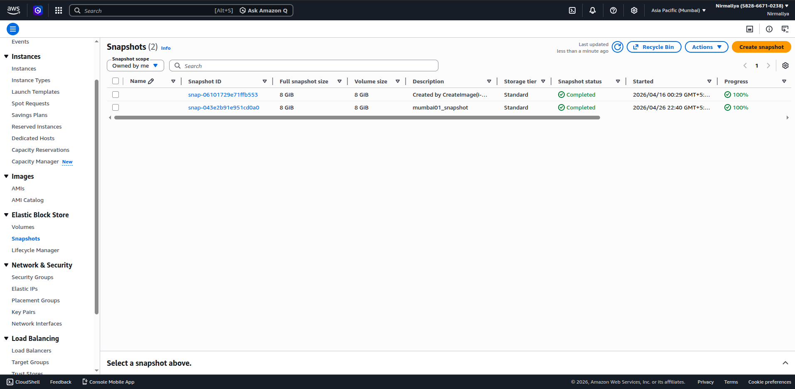
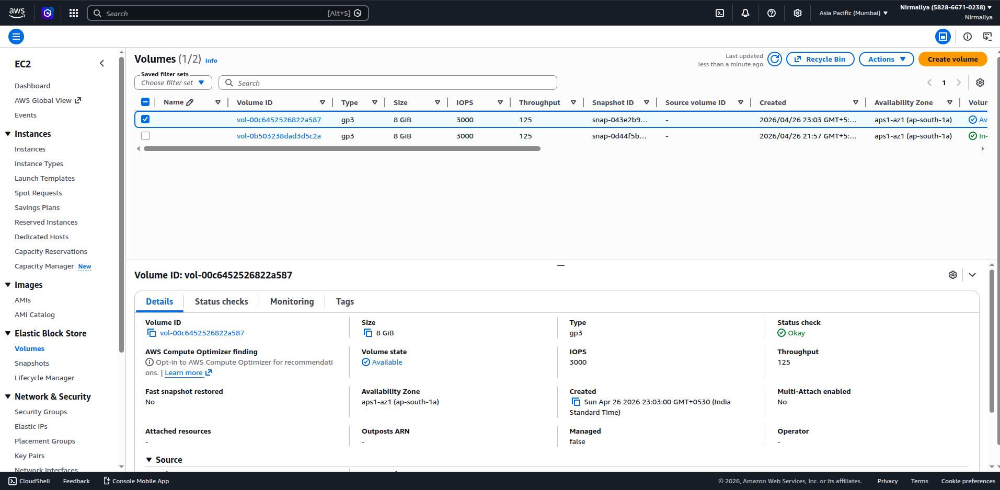
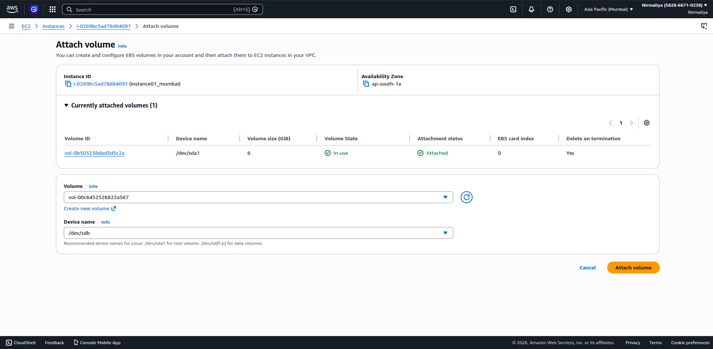
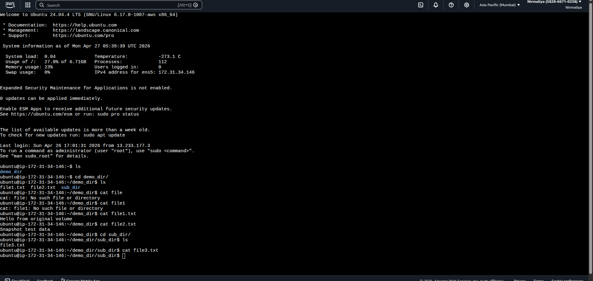

# **EBS Snapshot and Volume Restoration Demo (AWS EC2)**

## **Objective**

This project demonstrates how to:

- Launch an EC2 instance

- Create files and directories

- Take a snapshot of an EBS volume

- Create a new EBS volume from the snapshot

- Attach it to an EC2 instance

- Verify that the data persists

## **Architecture Overview**

- EC2 Instance (Linux)

- Original EBS Volume

- EBS Snapshot

- Restored EBS Volume

## **Step 1: Launch EC2 Instance**

1.  Go to AWS Console → EC2 → Launch Instance

2.  Configure:

    1.  AMI: Amazon Linux or Ubuntu

    2.  Instance Type: t2.micro

    3.  Key Pair: Create or select an existing key pair

3.  Launch the instance

## **Step 2: Connect to the Instance**

## **Step 3: Create Files and Directories**

mkdir demo_dir  
cd demo_dir  
echo "Hello from original volume" \> file1.txt  
echo "Snapshot test data" \> file2.txt  
mkdir sub_dir  
touch sub_dir/file3.txt

## **Step 4: Identify the EBS Volume**

1.  Go to EC2 Dashboard → Instances

2.  Select your instance → Storage tab

3.  Note the Volume ID attached (root volume)

4.  Click Actions → Create Snapshot

5.  Provide a name and create the snapshot

## **Step 6: Create New Volume from Snapshot**

1.  Go to EC2 → Snapshots

2.  Select the snapshot

3.  Click Actions → Create Volume

4.  Create the volume

## **Step 7: Attach New Volume to EC2 Instance**

1.  Go to EC2 → Volumes

2.  Select the new volume

3.  Click Actions → Attach Volume

4.  Choose the instance

5.  Device name example:

## **Step 9: Verify Files**

Expected: All previously created files and directories should be
present.
