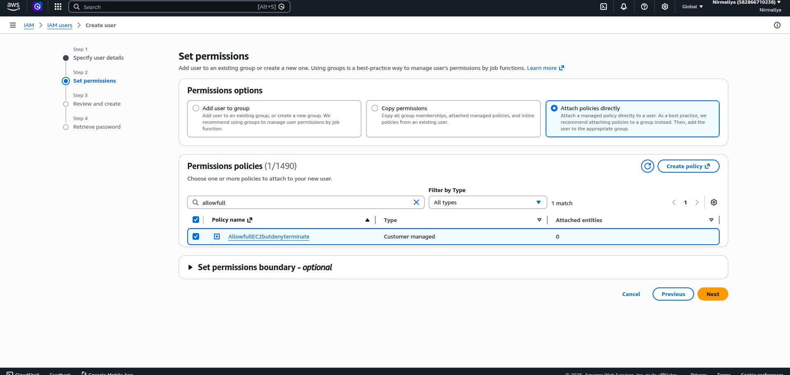
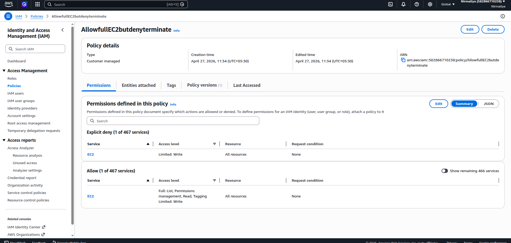

## **EC2: Allow all actions BUT deny termination**

**Meaning:**

- User can do anything with EC2 (start, stop, describe, etc.)

- But **cannot terminate instances**

**Key concept:**  
Explicit Deny overrides Allow

