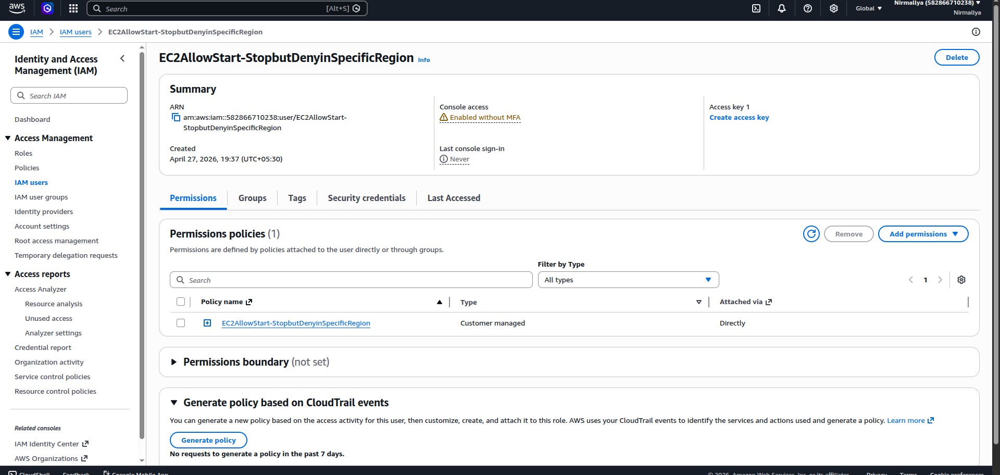
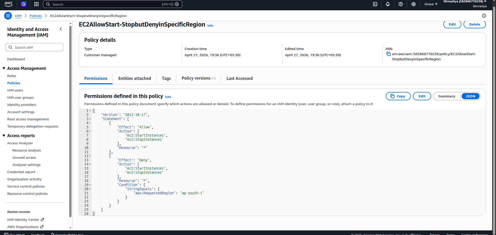

# **EC2 IAM Policy: Allow Start/Stop but Deny in Specific Region**

## **Objective**

Create an IAM policy that:

- Allows starting and stopping EC2 instances

- Denies these actions in a specific AWS region

## **Key Concepts**

- IAM policies use **Allow** and **Deny** statements

- **Explicit Deny overrides Allow**

- Region-based restrictions are implemented using **Condition**

- The condition key used is:

aws:RequestedRegion

