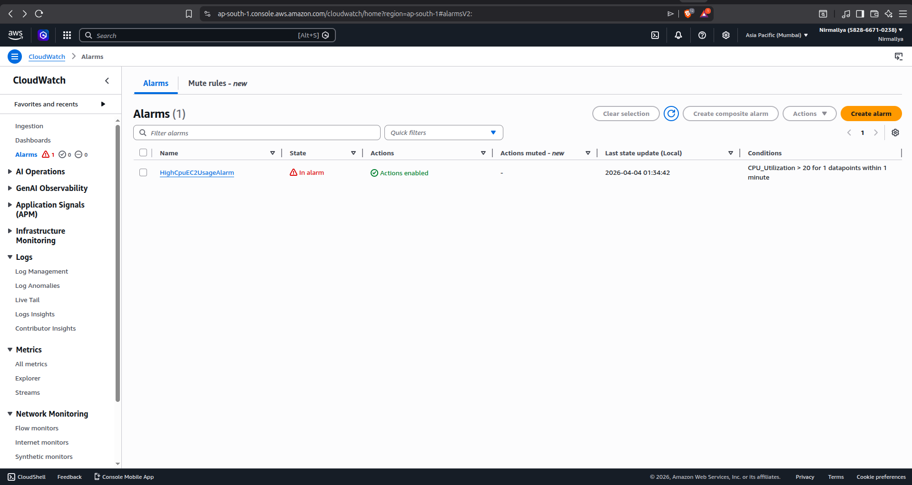
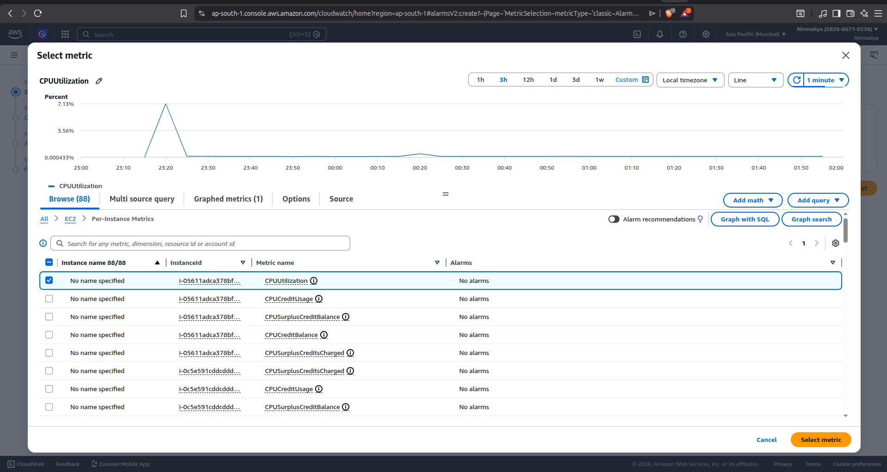
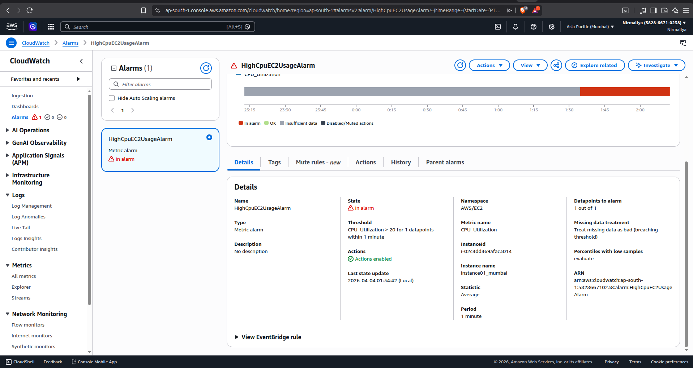
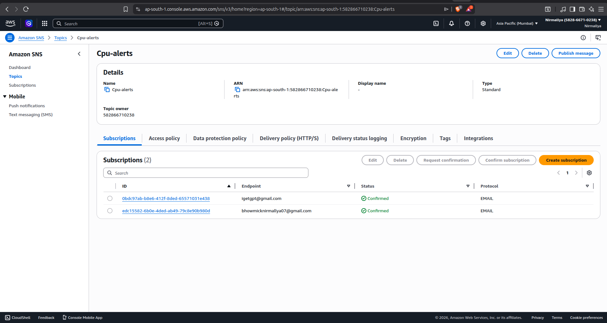
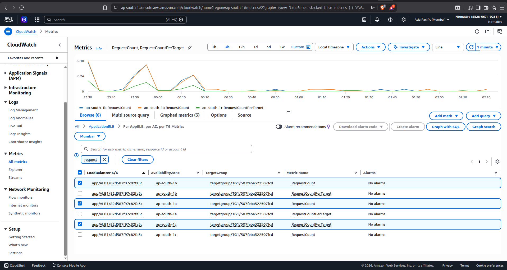
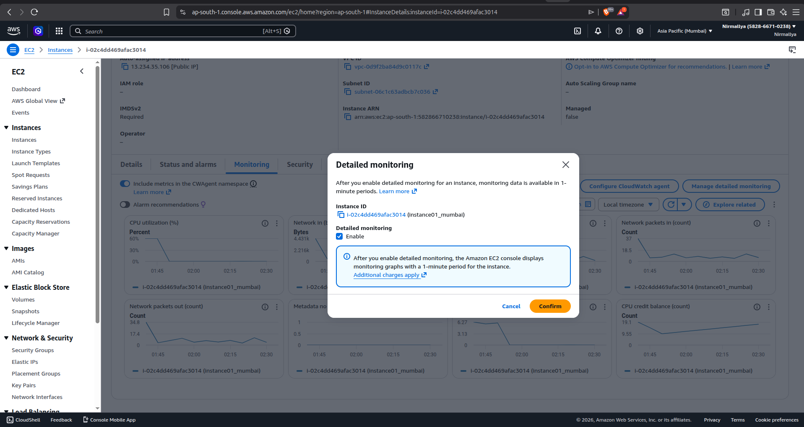

# **Enable CloudWatch Monitoring on AWS**

## **Objective**

Setting up monitoring for EC2 and ALB using CloudWatch, create alarms, and receive notifications via SNS.

Creating CPU utilization alarm:

\> Go to CloudWatch Service, in the alarms section, click create alarm.

{width="4.614583333333333in" height="2.455194663167104in"}

\> Select the Matrices, here for EC2, we will select CPU_utilization matric under EC2.

{width="4.464004811898513in" height="2.3750798337707786in"}

\>Select the instance we want to monitor, select the Threshold limit. Threshold type, Period, Data points.

(If period is 1 min and Data points are 2 out of 3, that's mean under 3 mins if two 1 min periods are breaking the conditions then the alarm should get triggered).

\>Also create an SNS topic where we can attach subscribers. On alarm triggering, the cloud watch should public the alarm notification to the SNS topic, so the subscribers (Email addresses here) will receive an email notification with the alarm details.

{width="5.208333333333333in" height="2.7711001749781277in"}

Creating an SNS topic:

\>Guide on how to create an SNS topic so cloud watch can publish alarm notifications on a topic, and subscribers can receive the notification.

\>Go to the SNS service. Under Topics, select the Topic type. For CloudWatch alarms, prefer Standard type, give it a name and then create the topic.

\>And then you can create Subscribers under Subscriptions. Selecting the topic, protocol, endpoints, and creating the subscription. And thus, attaching the subscribers to the topic.

{width="4.5319083552056in" height="2.411207349081365in"}

Monitor ALB Metrics:

\>To monitor an ALB matrix. I need to make sure that I have an active Application Load Balancer.

\>On CloudWatch \> All metrics \> ApplicationELB \> I can select various metrics to see the graphs and monitor. And cam also create alarms for specific metrics for ALB and can publish alarm notifications to SNS topics.

{width="6.354166666666667in" height="3.380742563429571in"}

Enable detailed monitoring for EC2:

\>On EC2, select an instance. Under Monitoring tab, click Manage detailed monitoring and enable it.

\> After we enable detailed monitoring for an instance, monitoring data is available in 1-minute periods

\>{width="6.5in" height="3.4583333333333335in"}
