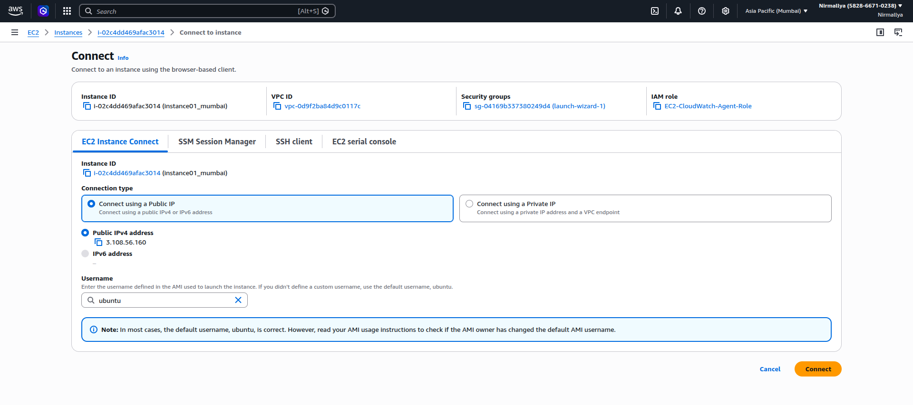
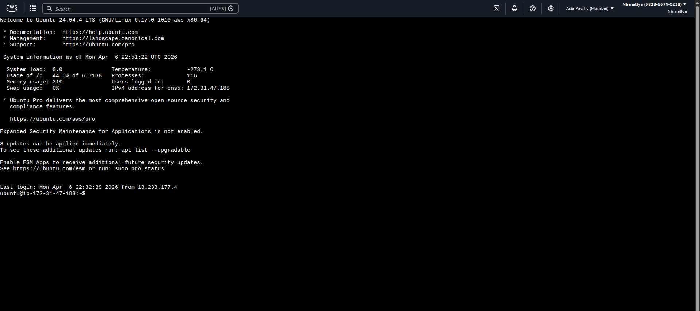
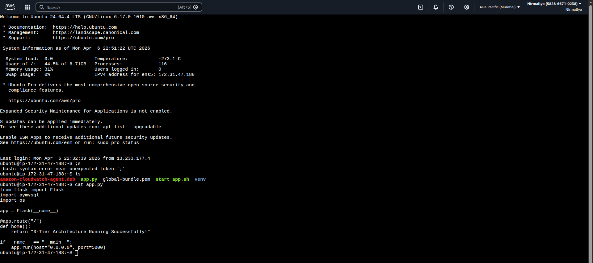
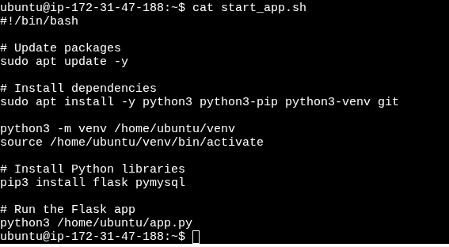
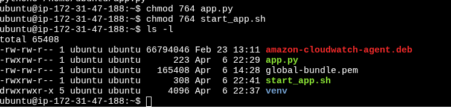
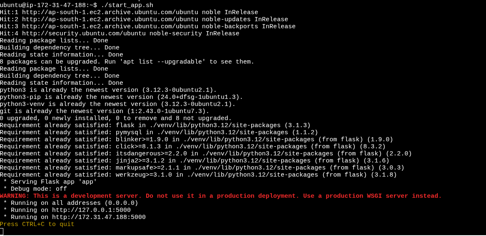
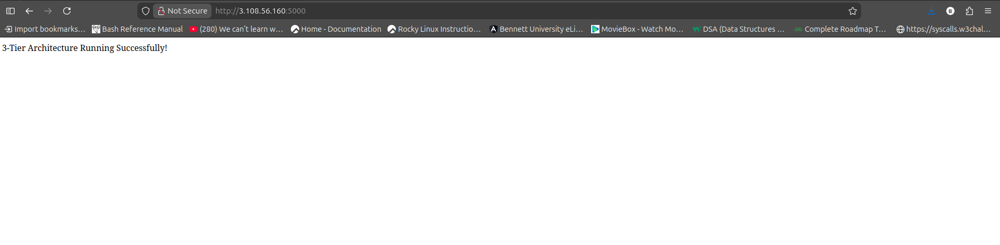
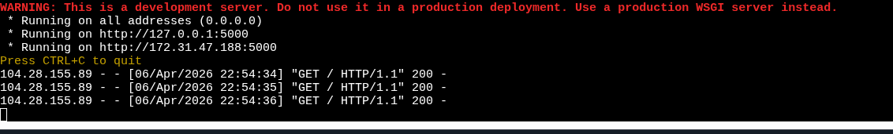
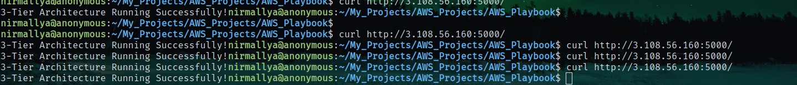

# **Flask Application Deployment on EC2**

## **Overview**

This project demonstrates how to deploy a simple Flask application on an AWS EC2 instance using a shell script and Python virtual environment.

## **Prerequisites**

-   AWS EC2 instance (Ubuntu)

-   SSH access to the instance

-   Security Group rules:

    -   SSH (22)

    -   Custom TCP (5000)

## **Step 1: Connect to EC2**

ssh -i \<your-key.pem\> ubuntu@\<your-ec2-public-ip\>\
{width="6.5in" height="2.8854166666666665in"}\
{width="6.5in" height="2.8854166666666665in"}

## **Step 2: Create Flask Application**

nano /home/ubuntu/app.py

Paste:

from flask import Flask\
import pymysql\
import os\
\
app = Flask(\_\_name\_\_)\
\
\@app.route(\"/\")\
def home():\
return \"3-Tier Architecture Running Successfully!\"\
\
if \_\_name\_\_ == \"\_\_main\_\_\":\
app.run(host=\"0.0.0.0\", port=5000)

{width="6.5in" height="2.8854166666666665in"}

## **Step 3: Create Shell Script**

nano /home/ubuntu/start_app.sh

Paste:

#!/bin/bash\
\
set -e\
\
echo \"Updating packages\...\"\
sudo apt update -y\
\
echo \"Installing dependencies\...\"\
sudo apt install -y python3 python3-pip python3-venv git\
\
echo \"Creating virtual environment\...\"\
python3 -m venv /home/ubuntu/venv\
\
echo \"Activating virtual environment\...\"\
source /home/ubuntu/venv/bin/activate\
\
echo \"Installing Python libraries\...\"\
pip install \--upgrade pip\
pip install flask pymysql\
\
echo \"Starting Flask application\...\"\
python /home/ubuntu/app.py

{width="5.90625in" height="3.25in"}

## **Step 4: Make Script Executable**

chmod +x /home/ubuntu/start_app.sh\
{width="6.5in" height="1.5625in"}

## **Step 5: Run the Application**

./start_app.sh

{width="6.5in" height="3.1666666666666665in"}

## **Step 6: Access the Application**

Open in browser:

[http://\<your-ec2-public-ip\>:5000](http://<your-ec2-public-ip>:5000)

Expected output:

3-Tier Architecture Running Successfully!

{width="6.5in" height="1.59375in"}{width="6.5in" height="0.9791666666666666in"}

## **Verification**

curl <http://localhost:5000>\
{width="6.5in" height="0.6979166666666666in"}

## **Troubleshooting**

### **Port Not Accessible**

-   Ensure Security Group allows port 5000

### **Virtual Environment Issues**

sudo apt install python3-venv --y
