# **Hub-and-Spoke VPC Architecture (AWS)**

## **Overview**

In this project, I created a Hub-and-Spoke network architecture using AWS VPCs.

-   1 Hub VPC (central network)

-   2 Spoke VPCs (connected to hub)

-   VPC Peering used for connectivity

-   Route tables used to control traffic flow

## **Objectives**

-   Spoke1 can communicate with Hub

-   Spoke2 can communicate with Hub

-   Spoke1 CANNOT communicate with Spoke2

-   Traffic control done using route tables

## **Steps Performed**

### **1. Created VPCs**

-   Hub VPC to CIDR: 10.0.0.0/16

-   Spoke1 VPC to CIDR: 10.1.0.0/16

-   Spoke2 VPC to CIDR: 10.2.0.0/16

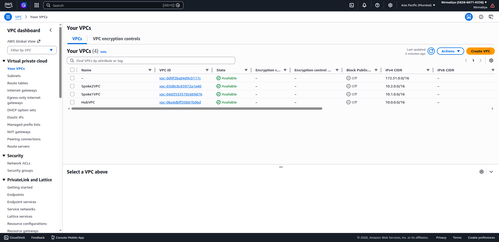{width="6.5in" height="3.15625in"}

### **2. Created Subnets**

Each VPC has at least one subnet:

Hub VPC

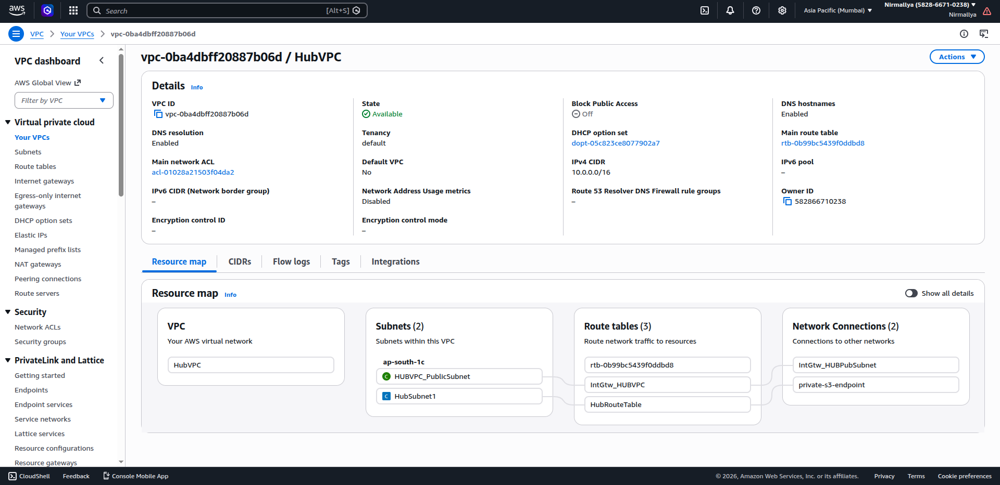{width="6.5in" height="3.15625in"}\
\
Spoke1 VPC

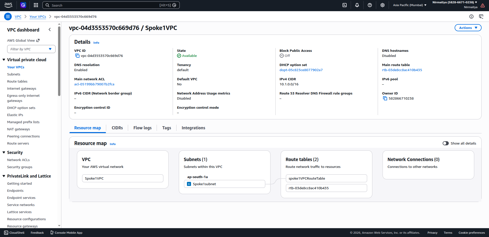{width="6.5in" height="3.15625in"}

Spoke2 VPC

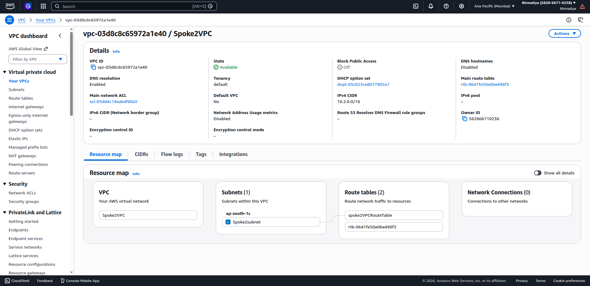{width="6.5in" height="3.15625in"}

### **3. Created VPC Peering Connections**

-   Hub \<-\>Spoke1

-   Hub \<-\> Spoke2

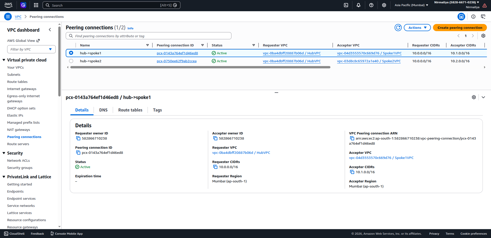{width="6.5in" height="3.15625in"}

Accepted both peering requests.

### **4. Updated Route Tables**

#### **For Hub VPC:**

-   Route to Spoke1 to via Peering1

-   Route to Spoke2 to via Peering2

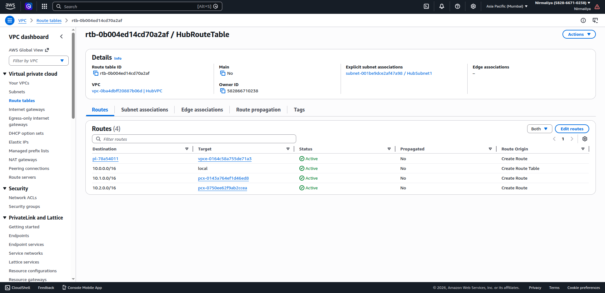{width="6.5in" height="3.15625in"}

#### **For Spoke1 VPC:**

-   Route to Hub to via Peering1

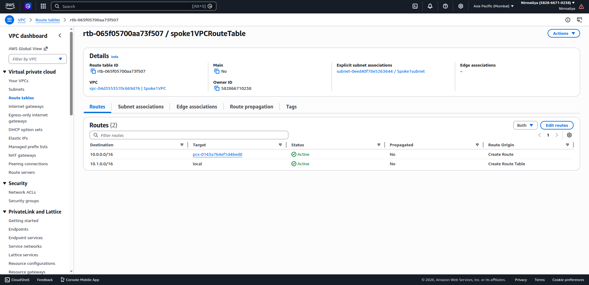{width="6.5in" height="3.15625in"}

#### **For Spoke2 VPC:**

-   Route to Hub to via Peering2

{width="6.5in" height="3.15625in"}

No routes added between Spoke1 and Spoke2

## **Traffic Control Logic**

-   Hub to Spoke1 Allowed

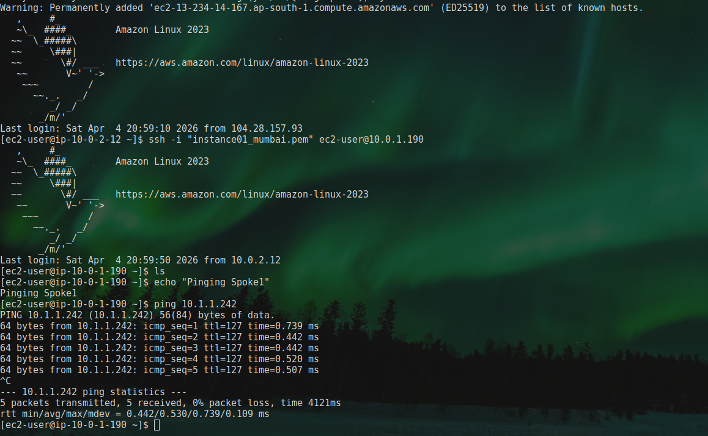{width="4.78125in" height="2.949970472440945in"}

-   Hub to Spoke2 Allowed

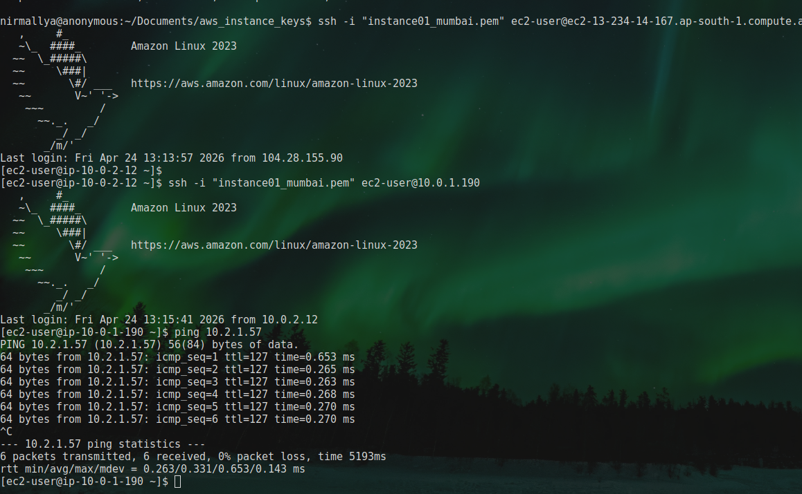{width="6.5in" height="4.010416666666667in"}

-   Spoke1 to Hub Allowed

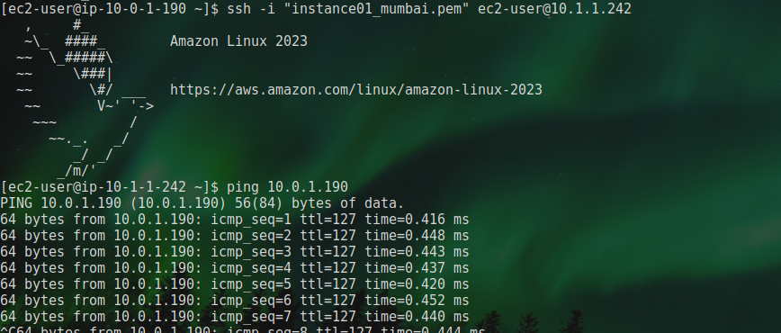{width="6.5in" height="2.7708333333333335in"}

-   Spoke2 to Hub ALLOWED

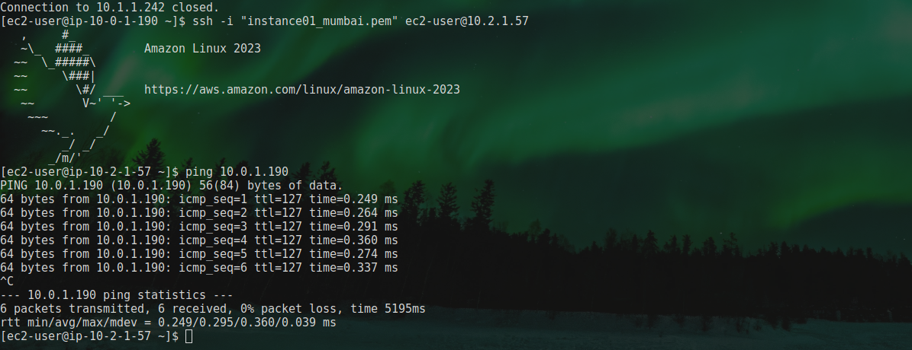{width="6.5in" height="2.5in"}

-   Spoke1to Spoke2 Blocked (No route exists) Not ALLOWED

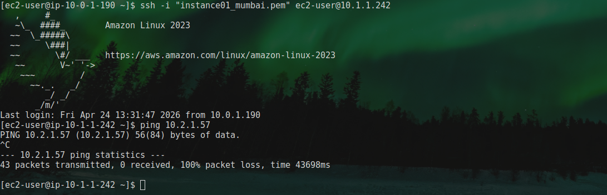{width="6.5in" height="2.09375in"}

## **Conclusion**

This project demonstrates how Hub-and-Spoke architecture works in AWS using VPC Peering and route tables.

It also shows how traffic can be controlled by simply managing routes instead of complex configurations.
