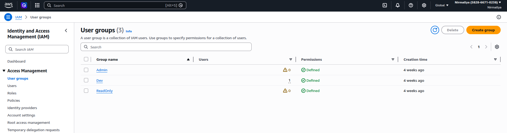
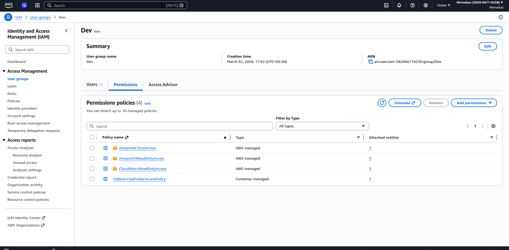
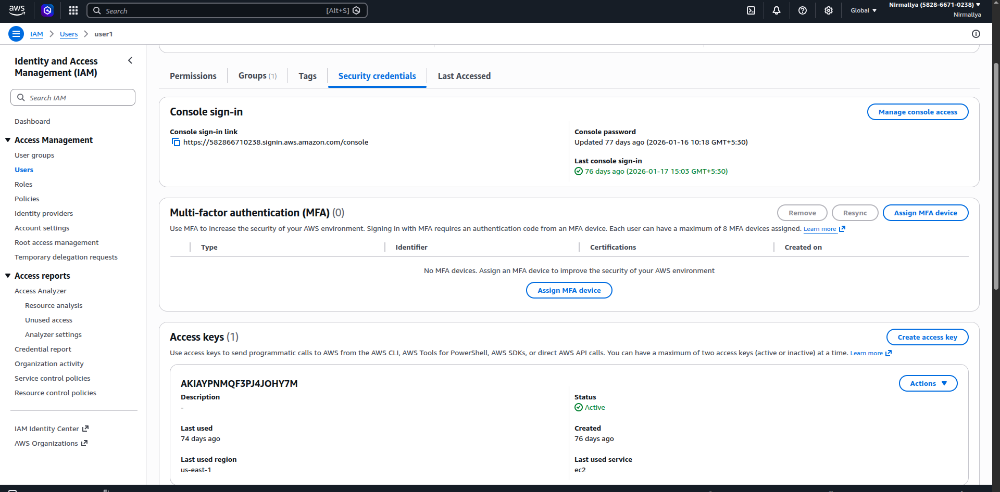
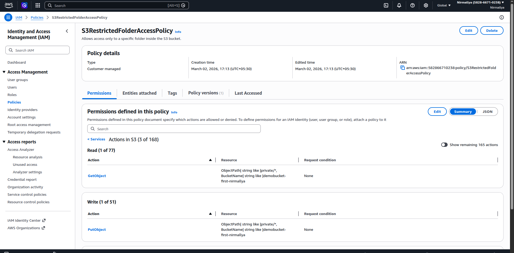
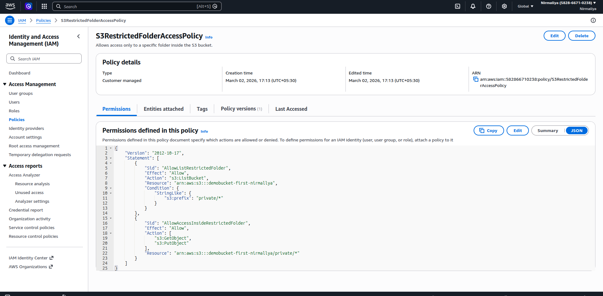

Implementing IAM Best Practices:

Creating user groups like Admin, Dev, ReadOnly

{width="6.5in" height="1.7083333333333333in"}

Steps to create user group:

\> Search for IAM Service and select it.

\> Click on create Group.

\> We can name the user group, add users to the group, attach permission policies to the Group.

Applying least privileged policies to the user groups:

\> While creating a user group or we can click on an existing user group and click Add permissions to attach permissions policies.

\> And select the desired policies we want to attach to a user group.

{width="4.739583333333333in" height="2.3318143044619424in"}

Enable MFA for the Root user:

\> Login as a Root user, click on security credentials and assign MFA by clicking assign mfa device under Multi Factor Authentication (MFA).

{width="6.5in" height="3.1979166666666665in"}

Create custom policy for S3 restricted folder access:

\>Under IAM we can create a custom policy by clicking on Policies under Access Management.

\>Then click Create Policy. Select the service. Here we select S3 service. And we add permissions that will be allowed under this custom policy.

{width="4.833333333333333in" height="2.3779385389326335in"}

\>Also, we can can see the permissions defines in this policy with Json too.

{width="4.989583333333333in" height="2.454811898512686in"}
