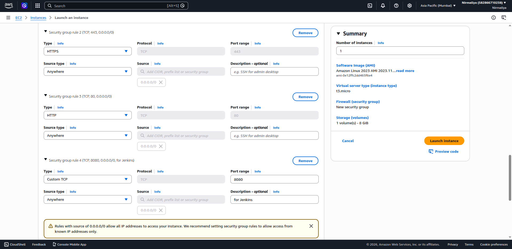
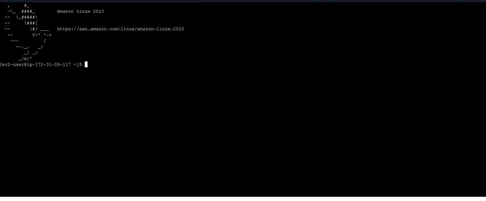
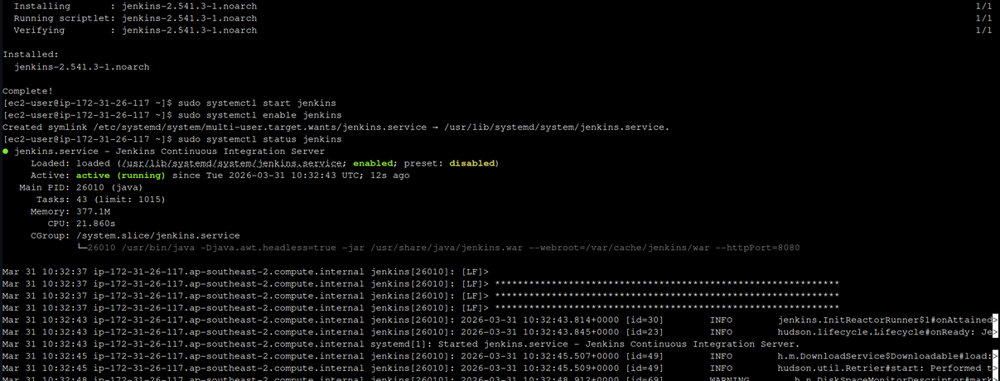
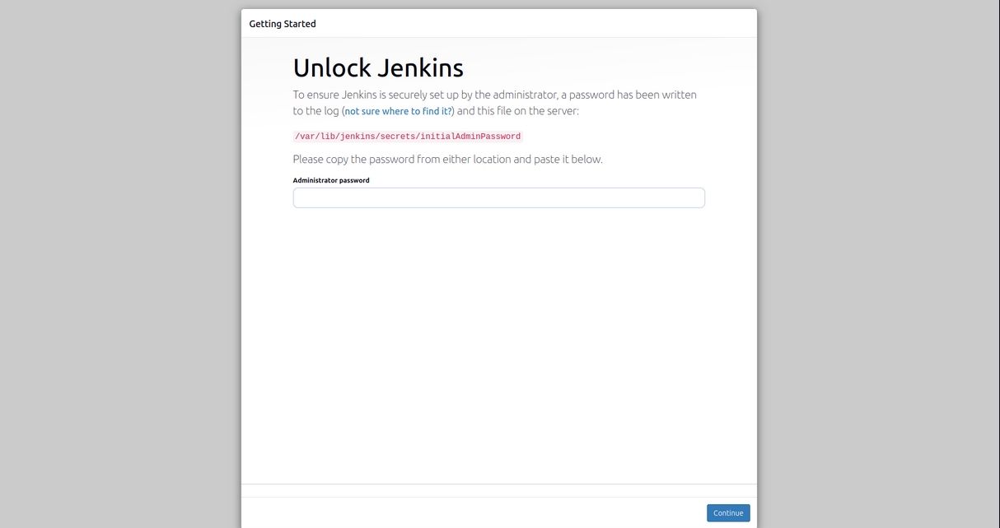
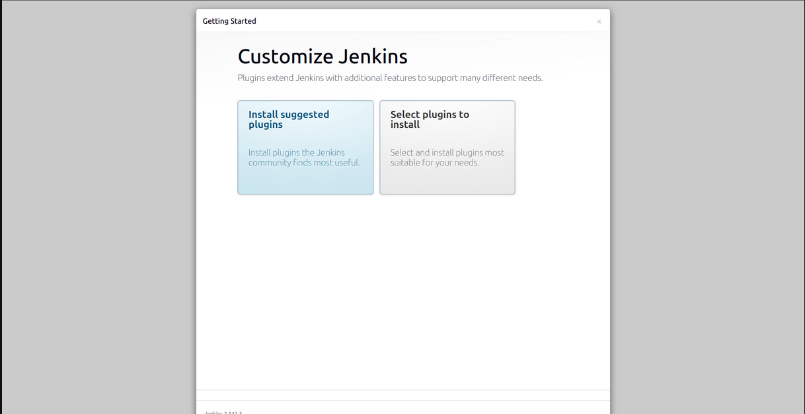
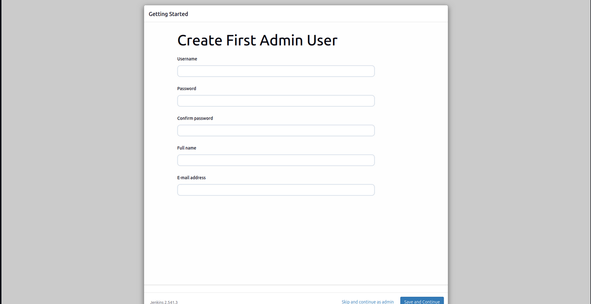
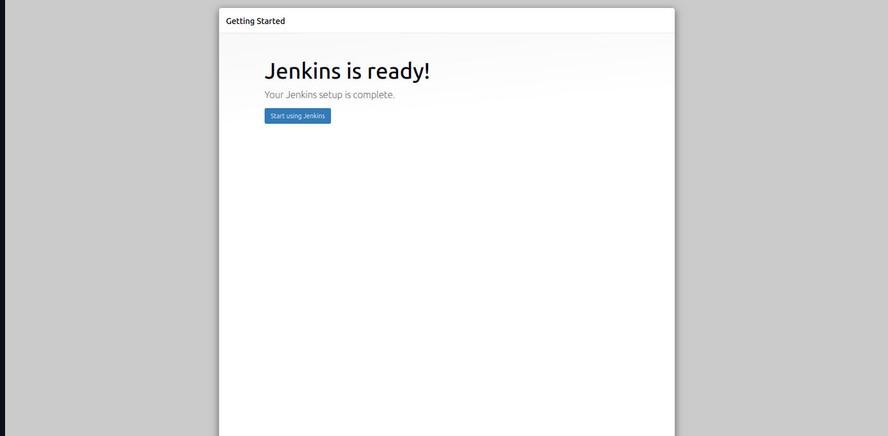

# **Jenkins Setup on AWS EC2**

## **Objective**

The purpose of this project is to install and configure Jenkins on an
AWS EC2 instance and access it through a web browser.

## **Steps Performed**

### **1. Launch EC2 Instance**

- Created a new EC2 instance using:

  - **AMI:** Amazon Linux

  - **Instance Type:** t3.micro

- Configured Security Group to allow:

  - Port **22** (SSH)

  - Port **80** (HTTP)

  - Port **8080** (Jenkins)

### **2. Connect to EC2 Instance**

- Connected to the instance using **EC2 Instance Connect**
  (browser-based terminal).

### **3. Install Java and Jenkins**

Updated the system and installed required dependencies:

sudo dnf update -y  
sudo dnf install java-17-amazon-corretto -y  
sudo wget -O /etc/yum.repos.d/jenkins.repo
<https://pkg.jenkins.io/redhat-stable/jenkins.repo>  
sudo rpm --import
<https://pkg.jenkins.io/redhat-stable/jenkins.io-2023.key>  
sudo dnf install jenkins -y

### **4. Start Jenkins Service**

Start and enable Jenkins:

sudo systemctl start jenkins  
sudo systemctl enable jenkins  
sudo systemctl status jenkins

### **5. Access Jenkins in Browser**

- Open browser and go to:

[http://\<my-instance-public-ip-address\>:8080](http://<my-instance-public-ip-address>:8080)

- Retrieve initial admin password:

sudo cat /var/lib/jenkins/secrets/initialAdminPassword

### **6. Install Plugins**

- Selected **"Install Suggested Plugins"**

- Waited for installation to complete

### **7. Create Admin User**

- Entered:

  - Username

  - Password

  - Email

### **8. Jenkins Setup Complete**

- Jenkins dashboard successfully opened

## **Result**

Jenkins was successfully installed and configured on an AWS EC2 instance
and is accessible through a web browser.
