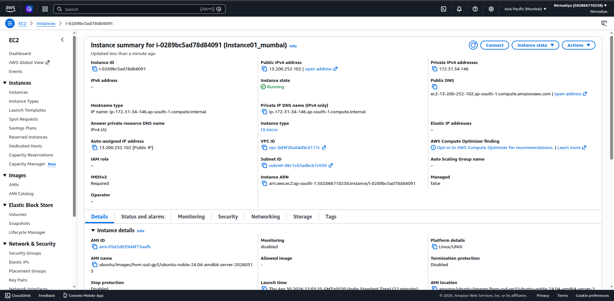
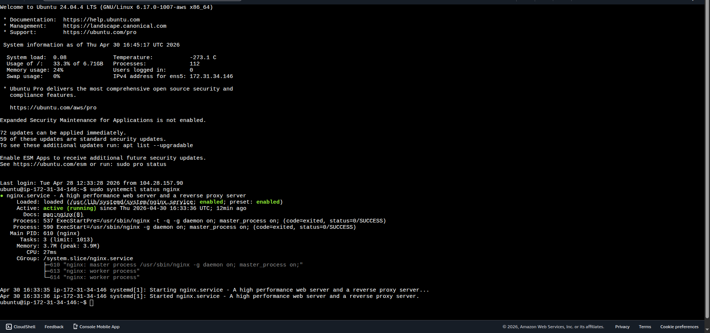
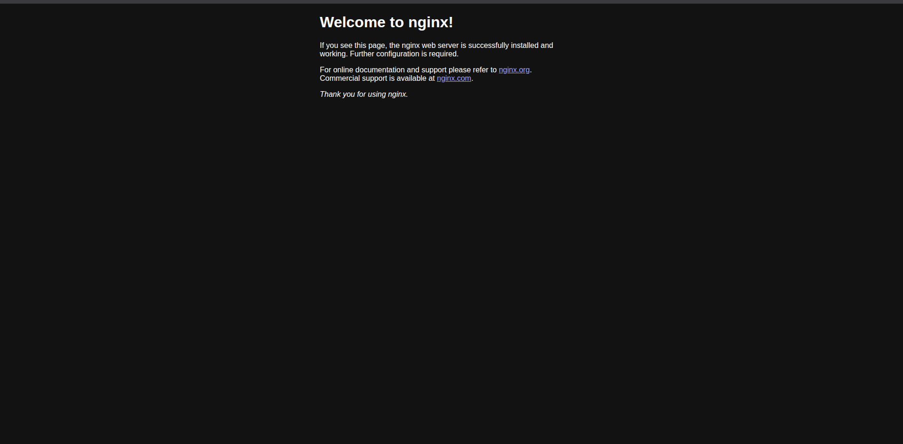

# Launch EC2 Instance and Install Nginx Web Server

### **Objective**

The goal of this exercise was to provision an EC2 instance and set it up
as a web server by installing and running Nginx. Once configured, the
server was verified by accessing it through its public IP address.

### **Steps performed:**

- Signed in to the AWS Management Console.

- Opened the EC2 service dashboard.

- Initiated the instance creation process by selecting **Launch
  Instance**.

- Chose the **Amazon Linux AMI** and selected the **t3.micro** instance
  type.

- Generated a new key pair and downloaded the .pem file for secure
  access.

- Configured the security group to permit inbound traffic on ports **22
  (SSH)** and **80 (HTTP)**.

- Launched the instance and waited until its status changed to
  **Running**.

- Connected to the instance using **EC2 Instance Connect**.

- Installed Nginx with the command:  
  sudo apt install nginx -y

- Verified and managed the service using:  
  systemctl status nginx

Finally, the web server was tested by entering the instance’s public
IPv4 address in a web browser. The successful display of the default
**Nginx welcome page** confirmed that the server was properly installed
and operational.

