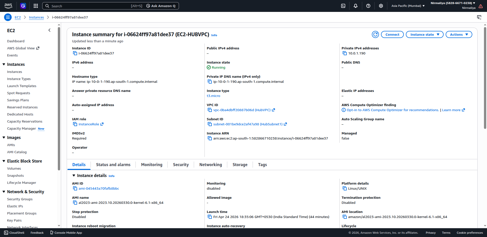
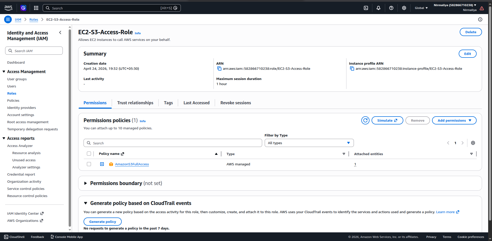
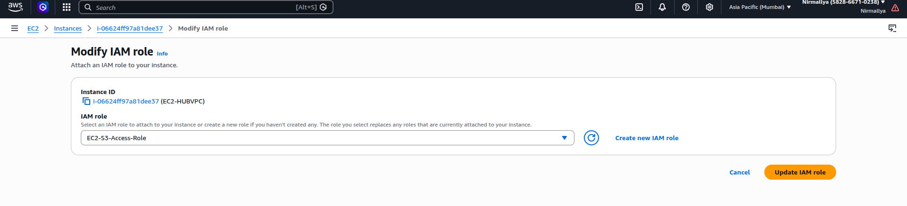
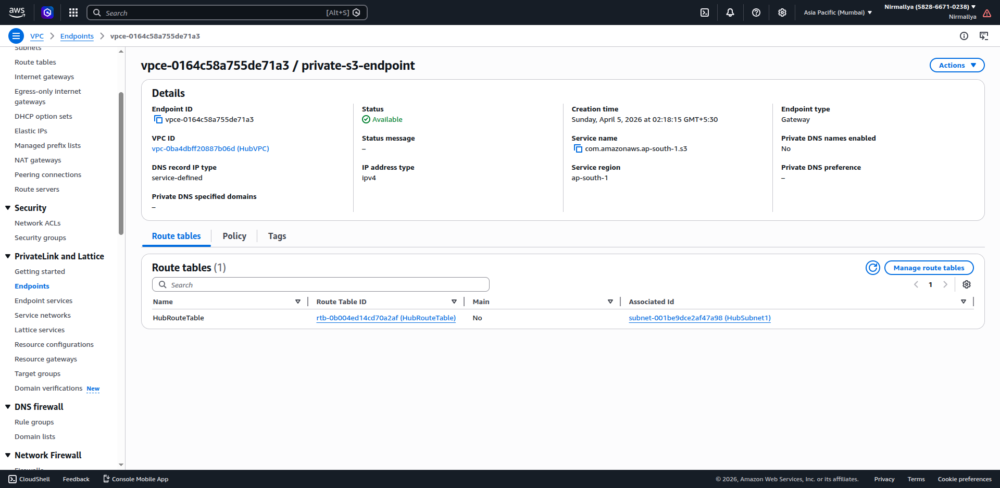
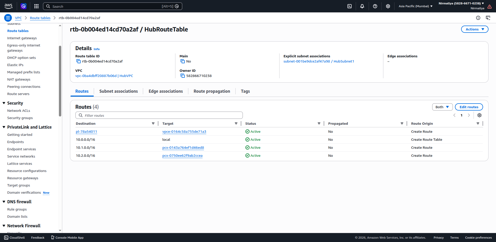
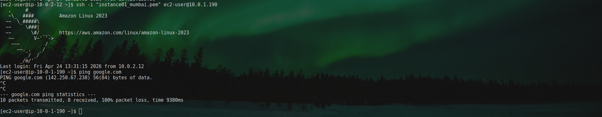
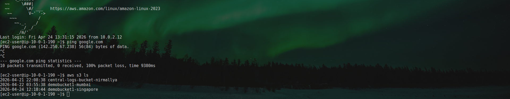

# **Private EC2 with S3 Access via VPC Endpoint**

## **Overview**

In this project, I configured a private EC2 instance to access Amazon S3 without using the internet.

-   Used a Gateway VPC Endpoint for S3

-   Removed NAT Gateway

-   Ensured EC2 cannot access internet

-   Verified access using AWS CLI

## **Objectives**

-   Private EC2 can access S3

-   Private EC2 cannot access internet

-   No NAT Gateway used

-   All traffic stays within AWS network

## **Steps Performed**

### **1. Launch Private EC2**

-   Launched EC2 in private subnet

-   Disabled auto-assign public IP

{width="4.677083333333333in" height="2.2785793963254592in"}

-   Attached IAM role with S3 access (AmazonS3FullAccess)

{width="6.5in" height="3.1875in"}{width="6.5in" height="1.4791666666666667in"}

### **2. Remove NAT Gateway**

-   Deleted NAT Gateway (if created earlier)

-   Removed route:

    -   0.0.0.0/0 → NAT Gateway

### **3. Create VPC Endpoint for S3**

{width="6.5in" height="3.1770833333333335in"}

### **4. Update Route Table**

Destination: pl-xxxx (S3 prefix list)\
Target: VPC Endpoint\
{width="6.5in" height="3.1770833333333335in"}

No internet route present.

## **Testing and Validation**

### **Connect to EC2**

### **Test Internet Access (should fail)**

ping google.com

Expected result:

-   Fails (no internet access)

{width="6.5in" height="1.2708333333333333in"}

### **Test S3 Access (should work)**

List buckets:

aws s3 ls\
{width="6.5in" height="1.2708333333333333in"}

It Works as Expected.

## **Results**

-   S3 access works without internet

-   Internet access is blocked

-   Traffic routed via VPC Endpoint

## **Key Concept**

Gateway Endpoint allows private communication between VPC and S3 without using:

-   Internet Gateway

-   NAT Gateway

## **Conclusion**

This project demonstrates secure and cost-efficient access to S3 from private EC2 instances using VPC Endpoints.

It avoids NAT Gateway cost and improves security by blocking internet access.
