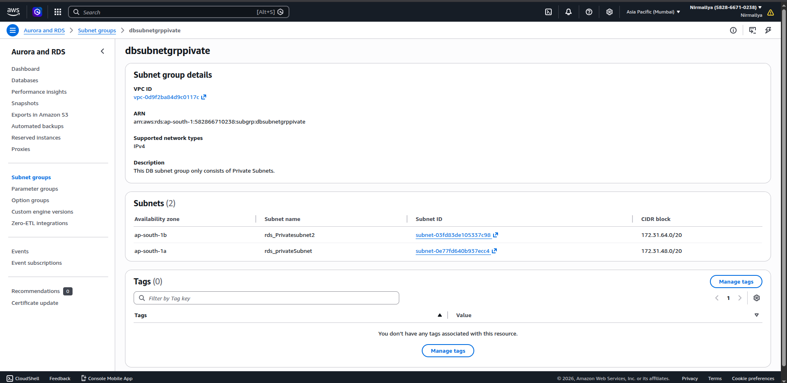
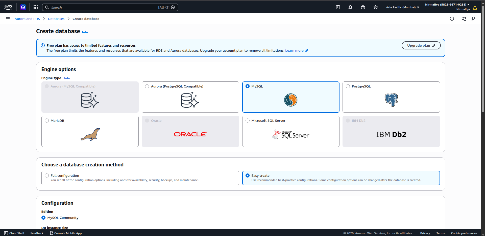
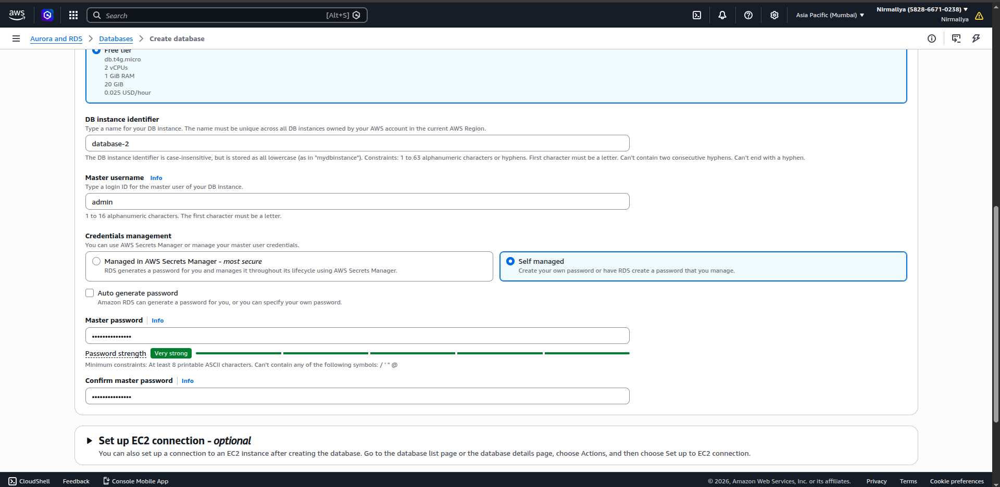
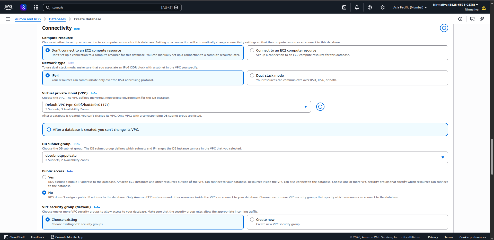
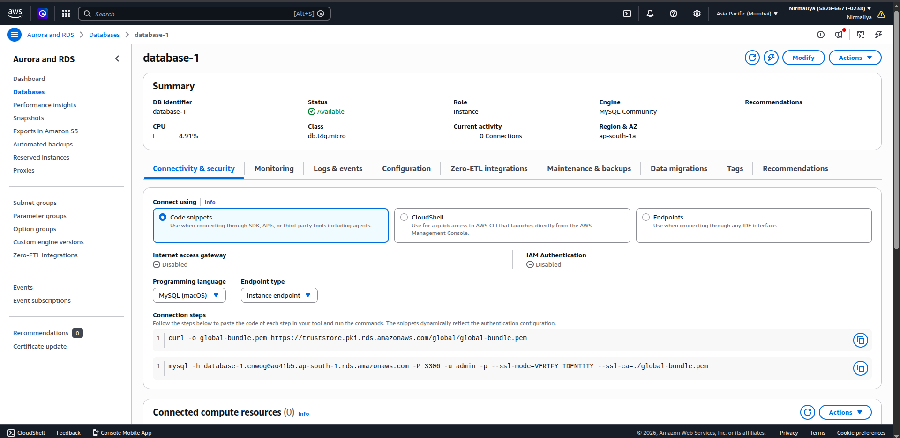
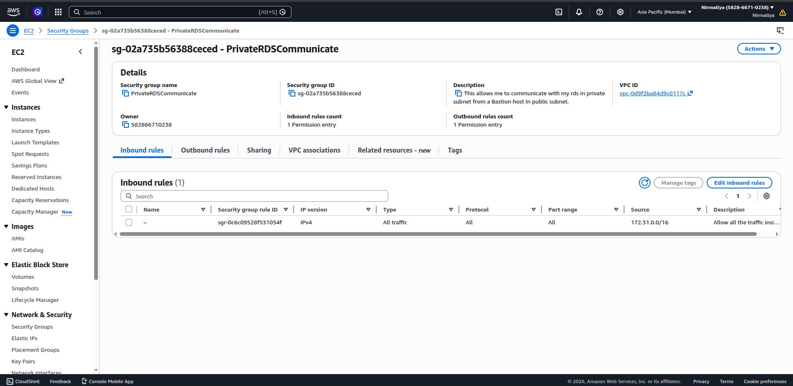
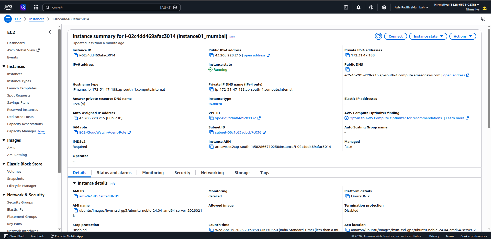
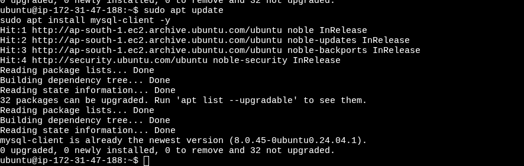
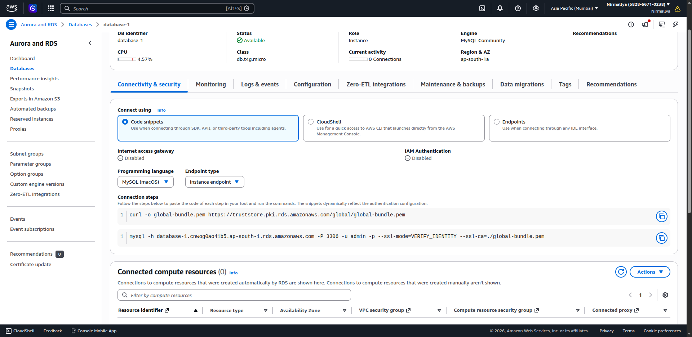
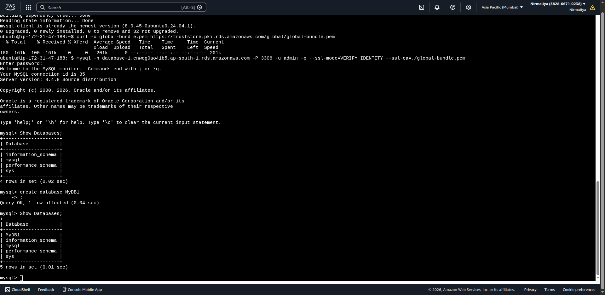

# **RDS MySQL Deployment (Simple Guide)**

## **Aim**

To deploy a MySQL database using Amazon RDS inside a private subnet, enable high availability and backups, and connect it with an EC2 instance.

## **What we are doing**

-   Launch RDS MySQL in private subnet

-   Create DB Subnet Group

-   Enable Multi-AZ (for backup/failover)

-   Enable automated backups

-   Connect it with EC2

## **Requirements**

-   A VPC with:

    -   At least 2 private subnets (in different AZs)

    -   1 public subnet (for EC2 if needed)

## **Step 1: Create DB Subnet Group**

1.  Go to RDS Console

2.  Click on **Subnet Groups**

3.  Click **Create DB Subnet Group**

4.  Fill details:

    a.  Name: name of your private subnet.

    b.  VPC: select your VPC

5.  Add 2 private subnets (important)

6.  Click Create

{width="6.5in" height="3.1666666666666665in"}

## **Step 2: Launch RDS MySQL**

1.  Go to **RDS → Databases → Create database**

2.  Engine: MySQL

{width="6.5in" height="3.1666666666666665in"}

### **Fill details**

-   DB name: As you wish

-   Username: admin

-   Password: (your password)

{width="6.5in" height="3.1666666666666665in"}

### **Connectivity**

-   VPC: your VPC

-   Subnet group: your private subnet group

-   Public access: No

{width="6.5in" height="3.1666666666666665in"}

### **Settings**

-   Enable Multi-AZ ✔

-   Enable automated backups ✔ (7 days is fine)

3.  Click **Create database**

{width="6.5in" height="3.1666666666666665in"}

## **Step 3: Security Groups**

### **For RDS**

-   Allow MySQL (port 3306)

-   Source: EC2 security group\
    \
    {width="6.25in" height="3.0416666666666665in"}

### **For EC2**

-   Allow outbound traffic (default works)

## **Step 4: Launch EC2 (App Server)**

1.  Launch EC2 instance

2.  Use same VPC

3.  Attach security group\
    \
    {width="6.25in" height="3.0416666666666665in"}

## **Step 5: Connect EC2 to RDS**

### **Install MySQL client**

sudo apt update\
sudo apt install mysql-client --y\
\
{width="6.5in" height="2.0729166666666665in"}

### **Connect**

mysql -h \<endpoint\> -u admin --p OR use the link in pic to connect.

Enter password when asked.\
\
{width="6.5in" height="3.1666666666666665in"}

## **Step 6: Test**

Check if connection works

{width="6.5in" height="3.1666666666666665in"}

## **Notes**

-   Multi-AZ helps in failover (if one AZ goes down)

-   Private subnet means DB is more secure

-   Always allow access only from EC2, not public

## **Conclusion**

We successfully deployed RDS MySQL in a private subnet, enabled backup and Multi-AZ, and connected it with EC2.
