# **RDS Read Replica Implementation (Simple Guide)**

## **Aim**

To create a MySQL RDS primary database, add a read replica, and test read-heavy workload.

## **What we are doing**

-   Create primary RDS MySQL

-   Add Read Replica

-   Separate read and write traffic

-   Simulate heavy read load

## **Step 1: Create Primary RDS**

1.  Go to RDS Console

2.  Click **Create Database**

3.  Choose:

    a.  Engine: MySQL

> 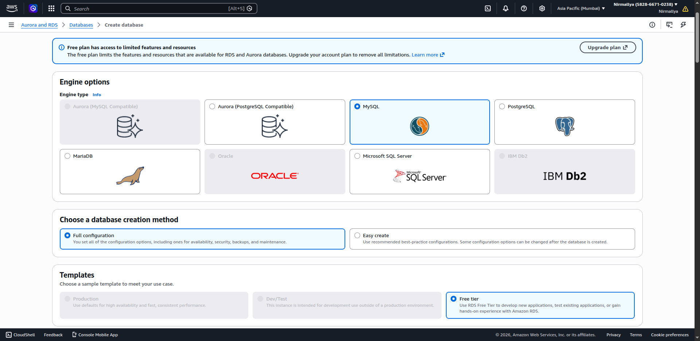{width="6.5in" height="3.1666666666666665in"}

### **Fill details**

-   DB identifier: as you wish

-   Username: admin

-   Password: set password\
    \
    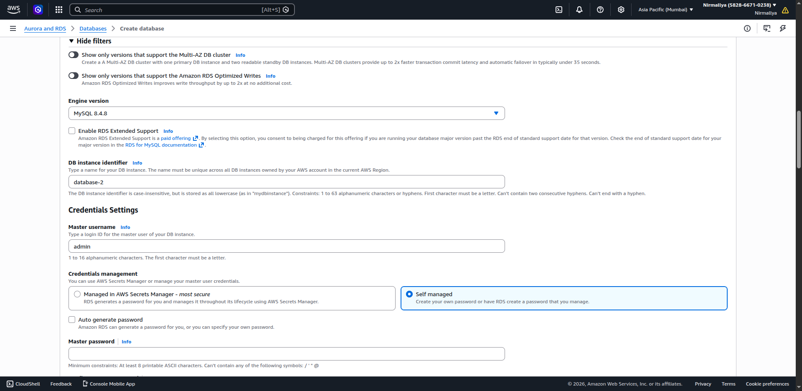{width="6.25in" height="3.0416666666666665in"}

### **Settings**

-   Enable backups ✔

-   Public access: No\
    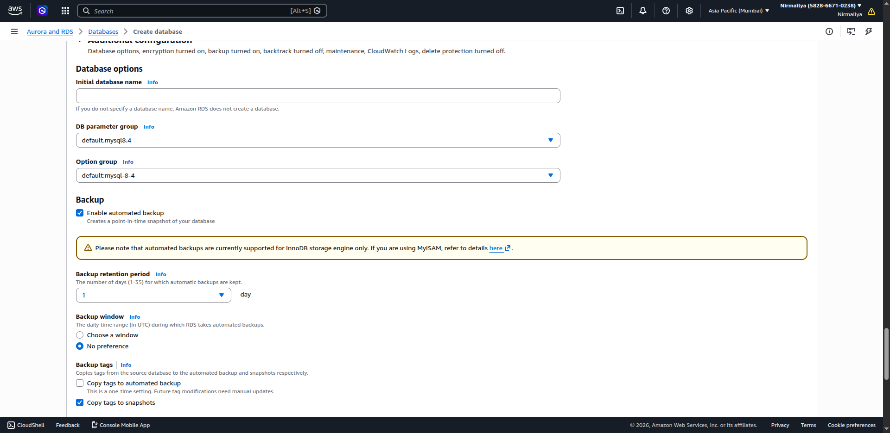{width="6.25in" height="3.0416666666666665in"}

4.  Click Create

## **Step 2: Create Read Replica**

1.  Select your primary DB

2.  Click **Actions → Create read replica**

3.  Give name: read-replica-db

4.  Choose same VPC

5.  Click Create\
    \
    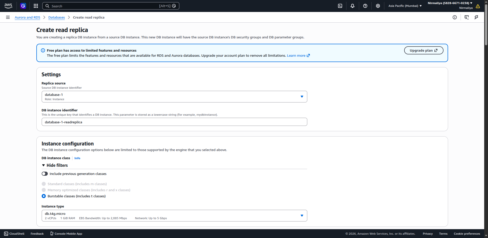{width="6.25in" height="3.0416666666666665in"}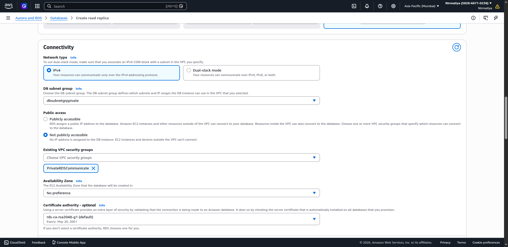{width="6.25in" height="3.0416666666666665in"}

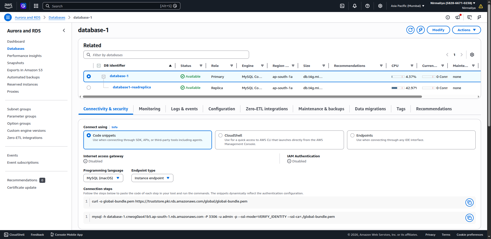{width="6.5in" height="3.1666666666666665in"}

## **Step 3: Understand Endpoints**

-   Primary DB → used for **write operations (INSERT, UPDATE, DELETE)**

-   Read Replica → used for **read operations (SELECT)**

## **Step 4: Connect from EC2**

### **Install MySQL client**

sudo apt update

sudo apt install mysql-client -y

### **Connect to primary (write)**

mysql -h \<primary-endpoint\> -u admin --p\
\
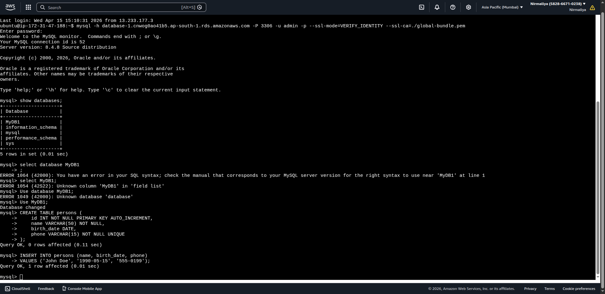{width="6.5in" height="3.1666666666666665in"}

### **Connect to replica (read)**

mysql -h \<replica-endpoint\> -u admin --p\
\
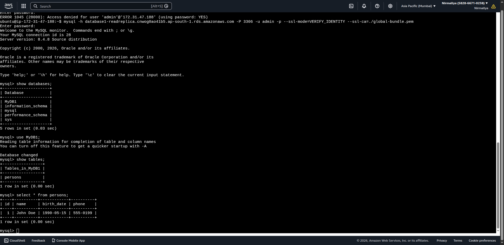{width="6.5in" height="3.1666666666666665in"}

## **Step 5: Simulate Heavy Read Load**

Run multiple read queries:

while true; do

mysql -h \<replica-endpoint\> -u admin --p'YOURPASS' -e \"SELECT \* FROM your_table;\"

Done

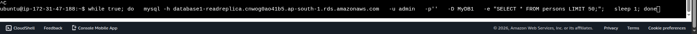{width="6.5in" height="0.3333333333333333in"}

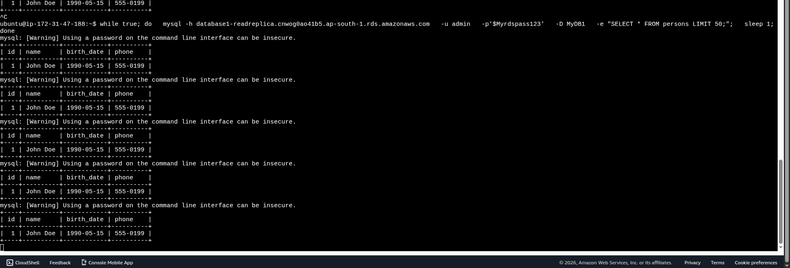{width="6.5in" height="2.2083333333333335in"}

Or open multiple terminals and run SELECT queries.

## **Step 7: Verify**

-   Data written in primary should appear in replica

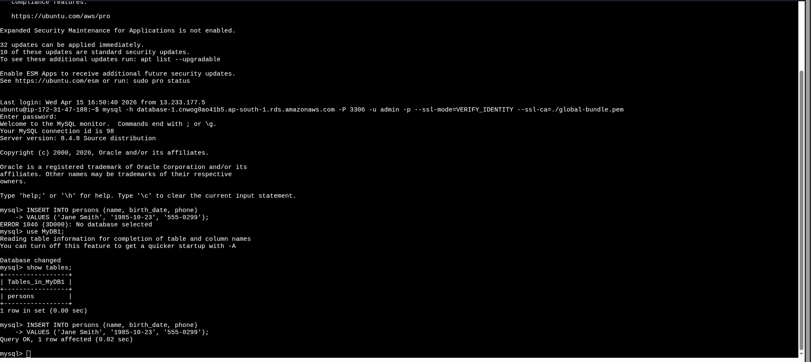{width="6.5in" height="2.90625in"}

-   Replica handles read traffic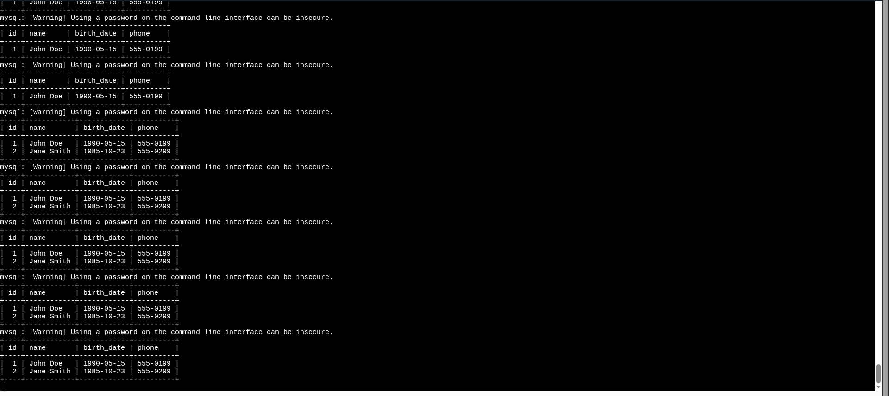{width="6.5in" height="2.90625in"}

We can see that new data inserted in primary db and the read replica has started showing up the same new data.

## **Notes**

-   Helps improve performance for read-heavy apps

-   Can scale by adding more replicas

## **Conclusion**

We created a primary RDS MySQL database, added a read replica, and tested read-heavy workload by sending SELECT queries to the replica.
