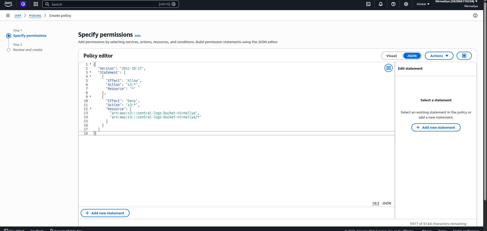
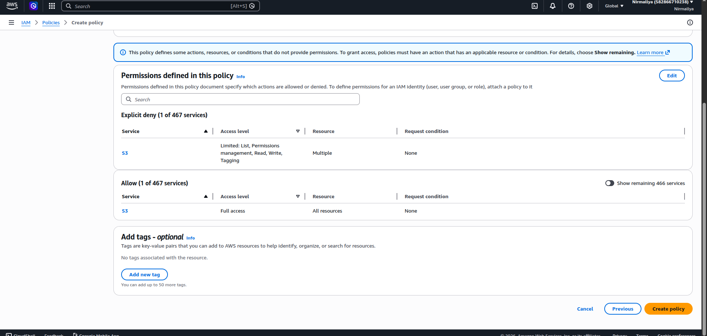
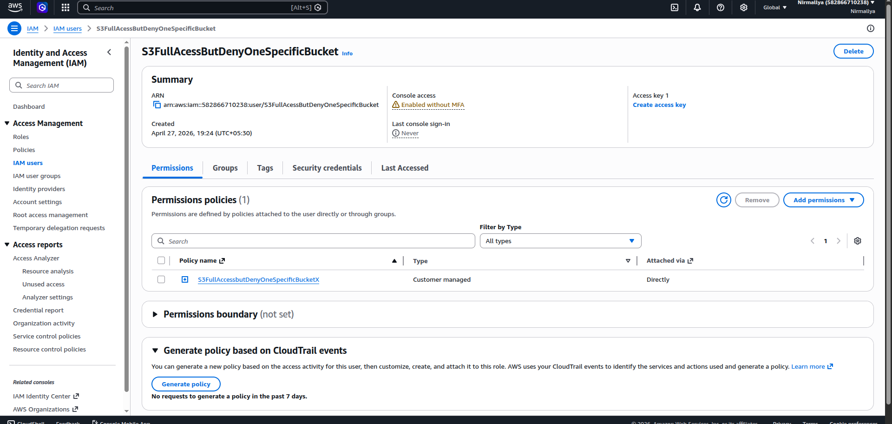

## **S3: Allow full access BUT deny one specific bucket**

**Meaning:**

- User can access all S3 buckets

- Except **one particular bucket** (you specify its ARN)

**Key concept:**

- Use wildcard \* for all buckets

- Add a specific Deny for one bucket

