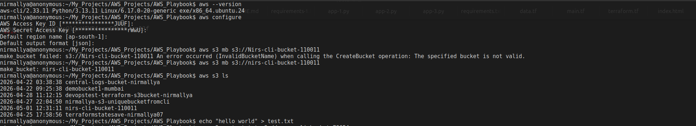
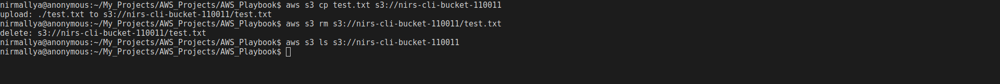

# S3 Bucket Creation and Management Using AWS CLI

## **Objective**

The objective of this task was to create and manage an S3 bucket using
the AWS CLI, including configuring credentials, uploading objects,
verifying contents, and performing cleanup operations within Amazon Web
Services.

## **Steps Performed**

1.  **Verify AWS CLI Installation**  
    Checked whether the AWS CLI was installed on the system using:

aws --version

2.  **Configure AWS CLI**  
    Configured the CLI with IAM user credentials:

aws configure

Provided the following details:

1.  AWS Access Key ID

2.  AWS Secret Access Key

3.  Default region: ap-south-1

4.  Default output format: json

<!-- -->

3.  **Create an S3 Bucket**  
    Created a new S3 bucket:

aws s3 mb s3://nirs-cli-bucket-110011

4.  **Verify Bucket Creation**  
    Listed all available buckets to confirm creation:

aws s3 ls

5.  **Create a Sample File**  
    Generated a test file locally:

echo "hello world" \> test.txt

6.  **Upload File to S3 Bucket**  
    Uploaded the file to the bucket:

aws s3 cp test.txt s3://nirs-cli-bucket-110011

7.  **Verify File Upload**  
    Checked the contents of the bucket:

aws s3 ls s3://nirs-cli-bucket-110011

8.  **Delete File from Bucket**  
    Removed the uploaded file:

aws s3 rm s3://nirs-cli-bucket-110011/test.txt

9.  **Final Verification**  
    Confirmed that the bucket is empty:

aws s3 ls s3://nirs-cli-bucket-110011

## **Thus,**

The S3 bucket was successfully created and managed using the AWS CLI.
All operations, including file upload, verification, and deletion, were
completed as expected.

