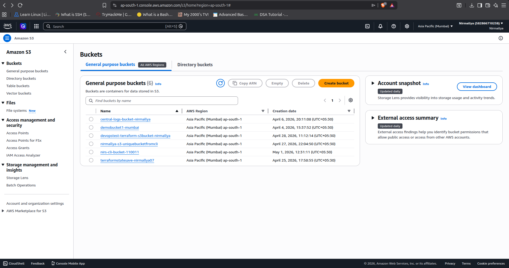
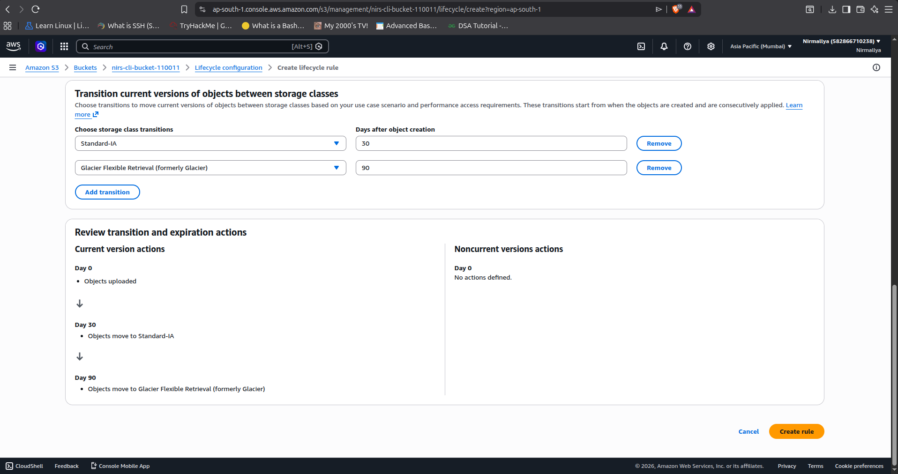
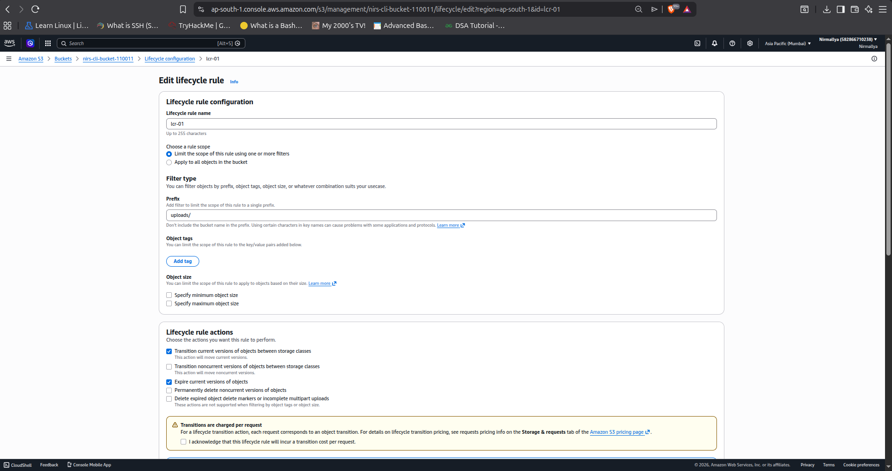
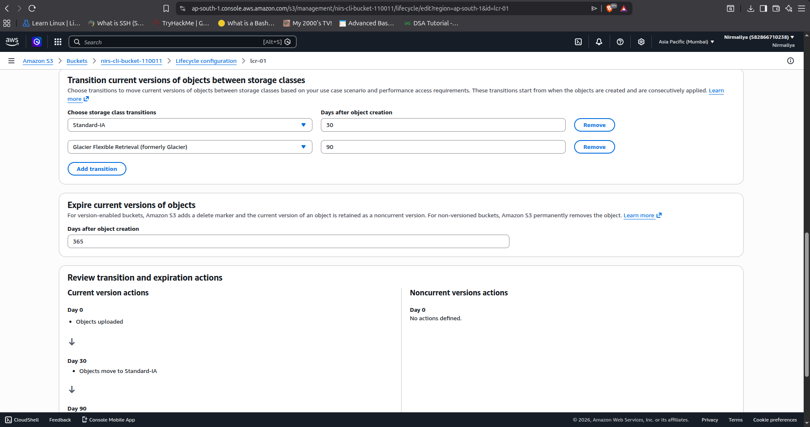
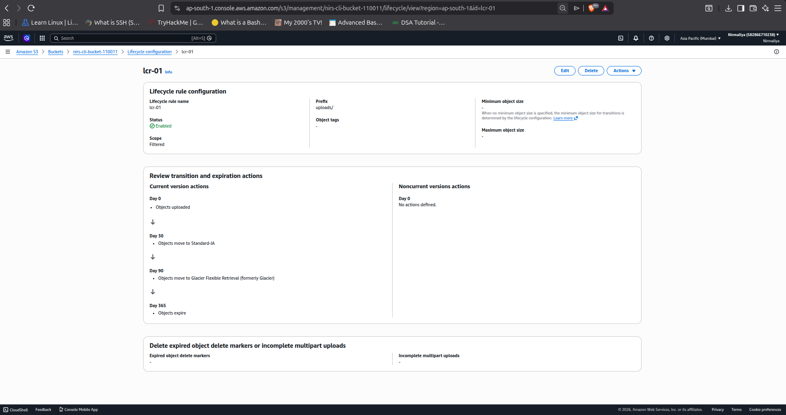

# **S3 Lifecycle Rule Configuration**

## **Objective**

The objective of this task was to create and configure a lifecycle rule
in an Amazon S3 bucket to automatically manage stored objects and reduce
storage costs.

## **Steps Performed**

### **1. Access S3 Service**

- Logged into the AWS Management Console

- Navigated to the S3 service

### **2. Create Lifecycle Rule**

- Opened the target S3 bucket

- Navigated to the Management tab

- Selected Create lifecycle rule

### **3. Configure Rule Details**

- Entered the rule name: uploads-smart-lifecycle

- Applied the rule to objects with the prefix: uploads/

### **4. Set Expiration Policy**

- Enabled expiration for objects

- Set expiration period to 365 days

### **5. Verify Lifecycle Rule**

- Confirmed that the lifecycle rule was successfully created

- Verified its visibility in the bucket configuration

## **Result**

The lifecycle rule was successfully created and configured. It
automatically manages objects within the specified prefix and helps
optimize storage costs.
